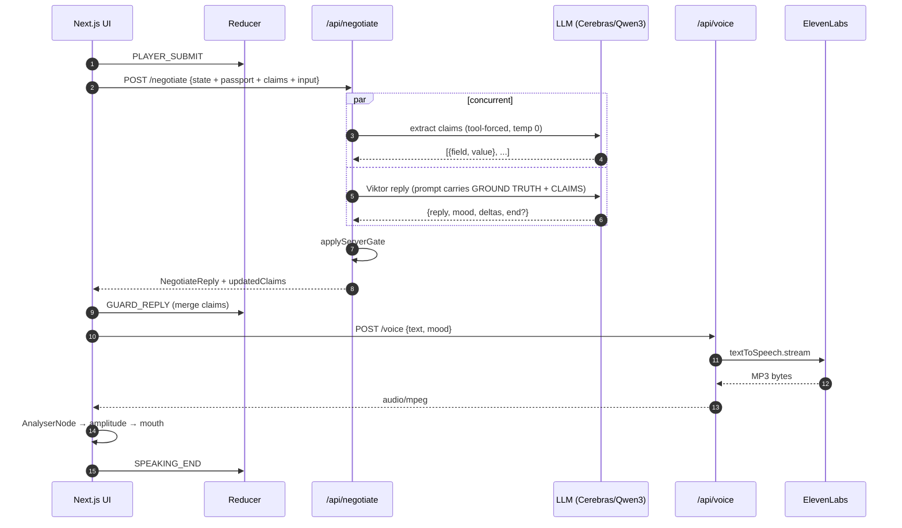
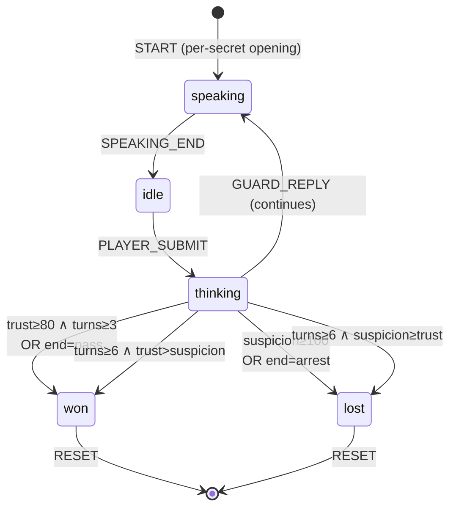

@AGENTS.md

# The Negotiator — agent guide

One-screen narrative voice game for the [Zed × ElevenLabs hackathon](https://hacks.elevenlabs.io/hackathons/5). The player types at border guard Viktor Marek; an LLM shapes his reply AND a second LLM extracts structured claims from the player's input. Viktor's prompt carries both the passport (ground truth) and the running claim list, so he can call out contradictions by name. ElevenLabs streams his voice. Audio amplitude drives mouth animation.

**Win:** trust ≥ 80 AND ≥ 3 exchanges → cross.
**Lose:** suspicion ≥ 100 → arrested. Or turn 6 with suspicion ≥ trust.

**Current deploy:** Next.js 16 + TS API routes on Vercel. **Future:** Rust backend on Cloudflare Workers (scaffolded, deferred post-submission).

## Read first

| Doc | When |
|---|---|
| [session.md](session.md) | Every new session — live handoff, what's in-flight, what to do next |
| [docs/STATUS.md](docs/STATUS.md) | Before picking up new work — what's done, what's blocked, phase map |
| [docs/ARCHITECTURE.md](docs/ARCHITECTURE.md) | Before touching architecture — topology, contracts, decisions, passport/claim flow |
| [docs/DEPLOYMENT.md](docs/DEPLOYMENT.md) | Before shipping — `vercel --prod` walkthrough, secrets, rollback |
| [docs/TESTING.md](docs/TESTING.md) | Before refactoring — what's tested, what isn't, philosophy |
| [docs/SUBMISSION.md](docs/SUBMISSION.md) | For the week-sprint plan — video shot list, social templates, submission form |
| This file | For conventions, non-negotiables, file map |

## Non-negotiable constraints (do not relitigate)

- **Audio is the core mechanic.** Do not weaken or bypass it.
- **Claim memory is load-bearing.** The passport + claim-extraction pipeline IS the gameplay differentiator. Don't remove it or weaken the interrogation prompt blocks.
- **Secrets stay server-side.** `LLM_API_KEY` / `ELEVENLABS_API_KEY` live in `.env.local` for now, Cloudflare Worker secrets later. Client only ever sees `NEXT_PUBLIC_API_URL` (post-R6).
- **Cost caps are load-bearing:** player input ≤ 180 chars, guard reply ≤ 220 chars, history ≤ 6 turns sent to LLM, claim extraction ≤ 120 tokens.
- **Viktor never breaks character** — no "as an AI", no stage directions, no meta commentary.
- **Never invent contradictions.** The interrogation rule block in `lib/llm.ts` explicitly says so — Viktor only calls out real mismatches grounded in the passport or prior claims.
- **ONE scenario until polished AND recorded.** Before building a second guard, scenario one must be video-ready. `.claude/skills/new-scenario/` gate enforces this.
- **Stateless backend.** Client holds game state (including passport + claims) and sends it each turn. Do not introduce server sessions, DashMap, WebSockets, Durable Objects.
- **No Docker, no VM, no AWS/GCP/Fly/Render.** Deployment is Vercel (+ Cloudflare Workers, future). Do not propose alternatives.
- **No server-side audio DSP.** It forces native crates and kills the WASM Worker deploy. If we want a radio-filter effect, do it client-side via `BiquadFilter` in the `useGuardVoice` AudioContext chain.
- **Single-viewport layout.** The game must fit in one viewport without window scrolling — both for UX and for vertical video capture. See U1 in STATUS.md.

## Current state (2026-04-24, Day 0 polish shipped)

### Frontend — feature-complete
- Next.js 16 + Turbopack, React 19
- Typechecks + lints clean, 39 TS tests passing
- Start screen + game scene in [app/page.tsx](app/page.tsx) (single client component)
- All UI components in [components/](components/): GuardPortrait (622 lines, anatomical redesign with life signs), PassportCard, TrustMeter, SuspicionMeter, DialogueLog, PlayerInput, MusicToggle, EndCard
- `useGuardVoice` in [lib/audio.ts](lib/audio.ts) — streaming fetch + amplitude RAF + graceful TTS fallback
- `useBackgroundMusic` in [lib/music.ts](lib/music.ts) — looping track + smooth RAF fades + duck/restore
- Pure reducer in [lib/gameState.ts](lib/gameState.ts) — win/lose, turn cap, passport, claims, `mergeClaims`
- `generatePassport` in [lib/passport.ts](lib/passport.ts) — Slavic name + origin pools, secret-biased purpose

### Backend (TypeScript — currently shipping)
- [app/api/negotiate/route.ts](app/api/negotiate/route.ts) — runs `extractClaims` + `negotiate` **concurrently** via `Promise.all`, returns `NegotiateReply + updatedClaims`. Error envelopes on 429/4xx/5xx.
- [app/api/voice/route.ts](app/api/voice/route.ts) — ElevenLabs Flash v2.5 streaming passthrough.
- [lib/llm.ts](lib/llm.ts) — Viktor system prompt with `GROUND TRUTH` + `PLAYER CLAIMS SO FAR` + `INTERROGATION RULES` blocks. `extractClaims()` is a separate tool-forced call at temp 0.
- [lib/gate.ts](lib/gate.ts) — `applyServerGate` (pure, 11 tests). Strips invalid `end=pass/arrest` claims.
- [lib/elevenlabs.ts](lib/elevenlabs.ts) — voice settings per mood.

### Rust backend — scaffold only (deferred)
- [backend/](backend/) crate compiles clean for `wasm32-unknown-unknown`
- [backend/src/lib.rs](backend/src/lib.rs) — `#[event(fetch)]` + Router
- [backend/src/types.rs](backend/src/types.rs) — mirrors TS types, camelCase via serde, **17 round-trip tests**
- [backend/src/handlers.rs](backend/src/handlers.rs) — **501 stubs**, deferred post-submission

### Known open issues
- **ElevenLabs API key in `.env.local` is invalid (401).** User needs to replace; voice fallback keeps game playable in the meantime.
- Cargo clippy shows dead-code warnings on Rust types that will be used when R2 lands.

## Commands

### Frontend
```bash
bun run dev         # Turbopack dev at :3000
bun run build       # production build
bun run typecheck   # tsc --noEmit
bun run lint        # eslint
bun run test        # bun test — 39 TS tests (reducer + gate + passport + claims)
bun run test:rust   # cargo test in backend/ — 17 tests
bun run test:all    # all 56 tests
bun scripts/playtest.ts   # empirical calibration against the running dev server
```

### Backend (scaffold only — use once R2+ lands)
```bash
cd backend
cargo check --target wasm32-unknown-unknown    # quick syntax check
cargo test                                     # 17 type-contract tests (native target)
cargo clippy -- -D warnings                    # lint
bunx wrangler dev                              # local Worker at :8787 (post-R2)
bunx wrangler deploy                           # deploy
bunx wrangler tail                             # live logs
bunx wrangler secret put LLM_API_KEY            # set secret
```

### Deploy (current — TS backend ships)
```bash
cd /path/to/game
vercel link                                    # one-time
vercel env add LLM_API_KEY production
vercel env add ELEVENLABS_API_KEY production
vercel --prod
```

## Architecture — the one flow that matters



Game state machine:



Every feature either feeds this loop or decorates it. Changes that don't fit here are out of scope. Deep dive: [docs/ARCHITECTURE.md](docs/ARCHITECTURE.md).

## File map

### Frontend (`./`)
- [app/page.tsx](app/page.tsx) — entire game UI + orchestration (client component, 262 lines)
- [app/layout.tsx](app/layout.tsx) — metadata + Geist Mono font
- [app/globals.css](app/globals.css) — dark theme, reactive rain (heavy layer + lightning overlay), flicker keyframes
- [app/api/negotiate/route.ts](app/api/negotiate/route.ts) — **DELETE after R6** (Rust handler replaces). Runs extraction + reply concurrently.
- [app/api/voice/route.ts](app/api/voice/route.ts) — **DELETE after R6**
- [lib/llm.ts](lib/llm.ts) — Viktor prompt + `extractClaims` — source of truth until ported to Rust at R2
- [lib/gate.ts](lib/gate.ts) — pure `applyServerGate`; kept separate so bun tests don't pull Next.js `server-only`
- [lib/llm.test.ts](lib/llm.test.ts) — gate unit tests (11)
- [lib/elevenlabs.ts](lib/elevenlabs.ts) — voice settings per mood; port to `backend/src/tts.rs`
- [lib/gameState.ts](lib/gameState.ts) — pure reducer + `mergeClaims`; stays in TS (client state)
- [lib/gameState.test.ts](lib/gameState.test.ts) — reducer + passport + claims tests (28)
- [lib/audio.ts](lib/audio.ts) — `useGuardVoice` hook (browser-only)
- [lib/music.ts](lib/music.ts) — `useBackgroundMusic` hook (browser-only)
- [lib/passport.ts](lib/passport.ts) — `generatePassport` generator (pure TS, client-side)
- [lib/types.ts](lib/types.ts) — Mood, Secret, Turn, Passport, Claim, NegotiateReply (mirror in Rust manually)
- [lib/api.ts](lib/api.ts) — **TO ADD at R5** — thin fetch wrappers calling Worker URL
- [components/GuardPortrait.tsx](components/GuardPortrait.tsx) — anatomical SVG + life signs + mood-driven muscles (622 lines)
- [components/PassportCard.tsx](components/PassportCard.tsx) — aged-paper ID card (108 lines)
- [components/TrustMeter.tsx](components/TrustMeter.tsx) — emerald + glow
- [components/SuspicionMeter.tsx](components/SuspicionMeter.tsx) — red + pulse on rise
- [components/DialogueLog.tsx](components/DialogueLog.tsx) — internal-scroll transcript (never bubbles to window)
- [components/PlayerInput.tsx](components/PlayerInput.tsx) — terminal-style textarea + stretch SEND + counter + hint
- [components/MusicToggle.tsx](components/MusicToggle.tsx) — speaker icon toggle
- [components/EndCard.tsx](components/EndCard.tsx) — CROSSED / ARRESTED overlay
- [public/music/ossuary-5-rest.mp3](public/music/ossuary-5-rest.mp3) — Kevin MacLeod, CC BY 3.0, 7.5 MB
- [scripts/playtest.ts](scripts/playtest.ts) — empirical calibration (5 archetypes × 3 seeds); will be replaced by Rust CLI in R7

### Backend (`backend/`)
```
backend/
├─ Cargo.toml                    # crate-type cdylib, edition 2021, workers-rs dep
├─ wrangler.toml                 # name, compatibility_date, build.command=worker-build
├─ README.md                     # Worker-specific dev notes
└─ src/
   ├─ lib.rs                     # #[event(fetch)] + Router
   ├─ handlers.rs                # /negotiate, /voice — 501 stubs (real at R4)
   ├─ llm.rs                     # TO ADD at R2 — Viktor prompt + OpenAI-compatible LLM client (Cerebras default) + tool schema + extractClaims
   ├─ tts.rs                     # TO ADD at R3 — ElevenLabs client + mood→voice settings
   ├─ types.rs                   # Mood, Secret, Turn, Passport, Claim, NegotiateReply + 17 tests
   └─ error.rs                   # thiserror enum + Into<Response>
```

Native-only CLI (NOT deployed, R7-optional):
```
playtest/
├─ Cargo.toml
└─ src/main.rs                   # local playtest tool
```

## Where common changes go

| If you want to change… | Edit |
|---|---|
| Viktor's persona / writing | [lib/llm.ts](lib/llm.ts) (before R2) → `backend/src/llm.rs` (after R2) |
| Interrogation rules | [lib/llm.ts](lib/llm.ts) — `INTERROGATION RULES` block in `system()` |
| Claim extraction logic / schema | [lib/llm.ts](lib/llm.ts) — `extractClaims()` |
| Claim merge rules (dedup) | [lib/gameState.ts](lib/gameState.ts) — `mergeClaims()` |
| Passport name/origin pools | [lib/passport.ts](lib/passport.ts) |
| Passport visual / layout | [components/PassportCard.tsx](components/PassportCard.tsx) |
| Viktor's face (anatomy, life signs) | [components/GuardPortrait.tsx](components/GuardPortrait.tsx) |
| Mood → eyebrow / mouth / cheek behaviour | Same file — `browAngleL`, `upperLipByMood`, `cheekOpacity` etc. |
| Voice feel per mood | [lib/elevenlabs.ts](lib/elevenlabs.ts) (before R3) → `backend/src/tts.rs` (after R3) |
| Voice ID | `ELEVENLABS_VOICE_ID` in `.env.local` / Vercel env / (post-R6) Worker secret |
| TTS model | `TTS_MODEL` const in elevenlabs.ts / tts.rs |
| Background music track | `MUSIC_SRC` const in [app/page.tsx](app/page.tsx) — swap the `public/music/*.mp3` path |
| Music duck/base volume, fade time | [lib/music.ts](lib/music.ts) — `BASE_VOLUME`, `DUCK_VOLUME`, `FADE_MS` |
| Starting trust/suspicion, turn cap, win threshold | [lib/gameState.ts](lib/gameState.ts) |
| Mood set | `Mood` enum in BOTH [lib/types.ts](lib/types.ts) AND `backend/src/types.rs` |
| Secret set | `Secret` enum same (plus `SECRET_FLAVOR` in llm.ts and bias map in passport.ts) |
| Scene visuals / ambience / background | [app/page.tsx](app/page.tsx) + [app/globals.css](app/globals.css) |
| Opening lines | `OPENINGS` constant in [app/page.tsx](app/page.tsx) — one per secret |
| Rain / lightning reactivity | [app/globals.css](app/globals.css) — `--suspicion-level` CSS var |

## Conventions

- TypeScript strict. Rust with `cargo clippy -- -D warnings` and no `.unwrap()` in handler code paths.
- Server-only TS modules start with `import "server-only"` (currently `lib/llm.ts` and `lib/elevenlabs.ts`; both disappear in R6).
- Types live in `lib/types.ts` on frontend and `backend/src/types.rs` on backend. Keep them mirrored manually — four types (`Mood`, `Secret`, `Passport`, `Claim`) + request/response envelopes, low drift risk. **Drift is caught by the Rust `types::tests` suite.**
- Reducer is pure. Async orchestration lives in `app/page.tsx`. The two LLM calls inside `/api/negotiate` run via `Promise.all` — parallel by design.
- Pure logic that wants tests (reducer, `applyServerGate`, `mergeClaims`) lives in files that DO NOT import `server-only` — put them in their own module if needed, then re-export from the server-only module. See `lib/gate.ts` / `lib/llm.ts` for the pattern.
- Tailwind v4, dark CRT-terminal aesthetic: emerald = player/trust, red = suspicion, neutral = guard, amber/gold = passport.
- Framer Motion for all state-driven animations. Always provide `initial` props on `motion.*` elements that animate; missing initial causes "animate from undefined" warnings.
- Client code must **validate payload shapes** before dispatching to the reducer. A 429 envelope looks nothing like a `NegotiateReply`, and dispatching undefined deltas poisons state into `NaN`. `app/page.tsx:onSubmit` does this check.
- Audio hooks (`useGuardVoice`, `useBackgroundMusic`) must never throw from their public API — callers rely on them resolving even when the network is down.
- No emojis in UI copy. Tone is dry and tense.
- Single cargo crate for the Worker. One binary, one responsibility.

## Tests — 56 total, all passing

- **TS (bun test) — 39 tests, 87 assertions:**
  - [lib/gameState.test.ts](lib/gameState.test.ts) — reducer (PLAYER_SUBMIT / GUARD_REPLY / SPEAKING_END / RESET), F1 regression, passport initial-shape, `mergeClaims` (dedup/trim/preserve), `GUARD_REPLY.updatedClaims` merging
  - [lib/llm.test.ts](lib/llm.test.ts) — `applyServerGate` (13 tests): "none" sweep, `end="pass"` gated by (trust+Δ ≥ 80 AND exchange ≥ 3), `end="arrest"` gated by (suspicion+Δ ≥ 100), purity, edge cases
- **Rust (cargo test) — 17 tests:**
  - [backend/src/types.rs](backend/src/types.rs) — serde round-trip per enum, camelCase contract on `NegotiateReply`, omits-when-None for `end` and omits-when-False for `fallback`, `playerInput` camelCase parsing, rejects snake_case `player_input`

**Run all:** `bun run test:all`. Add a test when a bug surfaces or when refactoring changes any JSON contract. Don't test React components or async external calls — those belong in manual/e2e review, not unit tests.

## Manual turn test

Current TS route (pre-R6):
```bash
curl -X POST http://localhost:3000/api/negotiate \
  -H 'content-type: application/json' \
  -d '{
    "secret":"contraband",
    "trust":40,
    "suspicion":30,
    "history":[],
    "playerInput":"just visiting my mother",
    "passport":{"name":"Anna Kowalczyk","origin":"Warsaw","purpose":"BUSINESS","photoSeed":42},
    "claims":[]
  }'
```

Returns `NegotiateReply + updatedClaims`. On LLM errors: server returns the fallback payload `{reply, mood:"suspicious", trustDelta:0, suspicionDelta:5, voiceStyle:"suspicious", fallback:true}`. On 429: server returns 429 with `retry-after` header and `{error:"rate_limited"}`.

Post-R4 (Rust Worker local):
```bash
curl -X POST http://localhost:8787/negotiate -H 'content-type: application/json' -d '...same body...'
```

## Project skills

Project-local skills in `.claude/skills/`, invokable as `/<name>`:

- [playtest-viktor](.claude/skills/playtest-viktor/SKILL.md) — 5 archetypes × 3 seeds autonomous playthroughs via `/negotiate`, reports trust/suspicion trajectories + win rates. Diagnosis only.
- [voice-ab](.claude/skills/voice-ab/SKILL.md) — generates ElevenLabs MP3 samples across voices/moods to `/tmp/negotiator-voice-ab/` for A/B listening.
- [new-scenario](.claude/skills/new-scenario/SKILL.md) — gated scaffolder for a second guard. Refuses to run until scenario 1 is polished AND recorded.

## What NOT to do (common agent failure modes)

- Do **not** suggest server-side sessions, DashMap, or WebSockets. Revisited and rejected in the plan.
- Do **not** suggest moving backend to Fly/Render/Railway/AWS/GCP/Oracle. Vercel + CF Workers is the settled answer.
- Do **not** add Docker or multi-stage builds. There are no containers in this project.
- Do **not** add `ts-rs`, `governor`, `moka`, `tower-http` middleware, or cargo workspaces unless explicitly asked. They are cut.
- Do **not** remove or weaken the passport / claim-memory system — it's the gameplay differentiator.
- Do **not** mock the LLM or ElevenLabs in tests that actually run them. Use real integration against a running Worker / dev server.
- Do **not** edit `app/api/*` routes after R6 has happened — they should be deleted.
- Do **not** dispatch `GUARD_REPLY` without validating the payload shape — NaN cascades through the entire UI.
- Do **not** throw from `useGuardVoice.speak()` or `useBackgroundMusic.start()` — callers expect graceful resolution.
- Do **not** commit any `.env.local` content or real secrets to git.
- Do **not** propose replacing SVG Viktor with Rive/Lottie/3D — evaluated and rejected; aesthetic match matters and the current SVG is under precise per-feature control.

## Hackathon deliverables still outstanding

Canonical list lives in [docs/STATUS.md](docs/STATUS.md) with estimates and blockers. Quick snapshot:

- [x] F1 Viktor gate
- [x] F2 Reactive rain + lightning
- [x] F3 Per-secret openings
- [x] F5 Graceful TTS fallback
- [x] P1 Passport UI
- [x] P2 Claim extraction pipeline
- [x] P3 Interrogation prompt
- [x] A1 Viktor anatomy redesign + life signs
- [x] U1 Viewport-lock + scroll-jank fix
- [x] U2 Input alignment + terminal prompt
- [x] U3 Background music + duck
- [x] R1 Rust scaffold
- [ ] F4 Typewriter SFX · F6 Mobile pass
- [ ] S1 `vercel --prod`
- [ ] S2 60 s vertical gameplay video + Zed B-roll + friend reaction
- [ ] S3 social post with `@zeddotdev @elevenlabsio #ElevenHacks`
- [ ] S4 submit on `hacks.elevenlabs.io/hackathons/5`
- [ ] R2–R7 deferred post-submission
