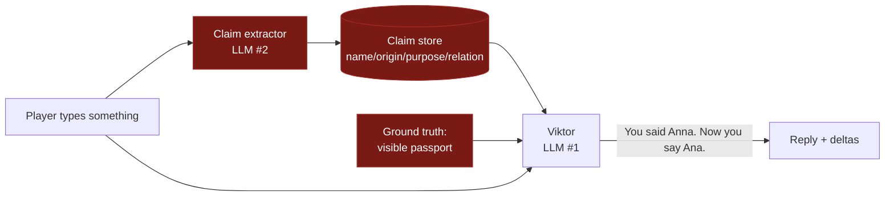
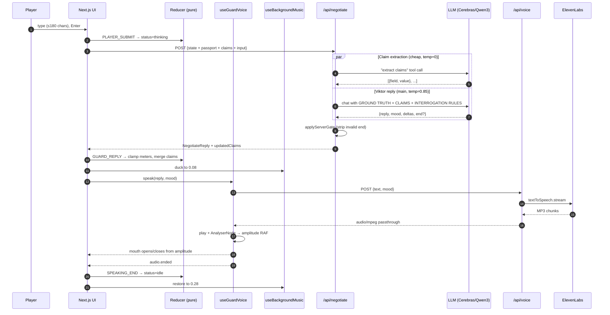
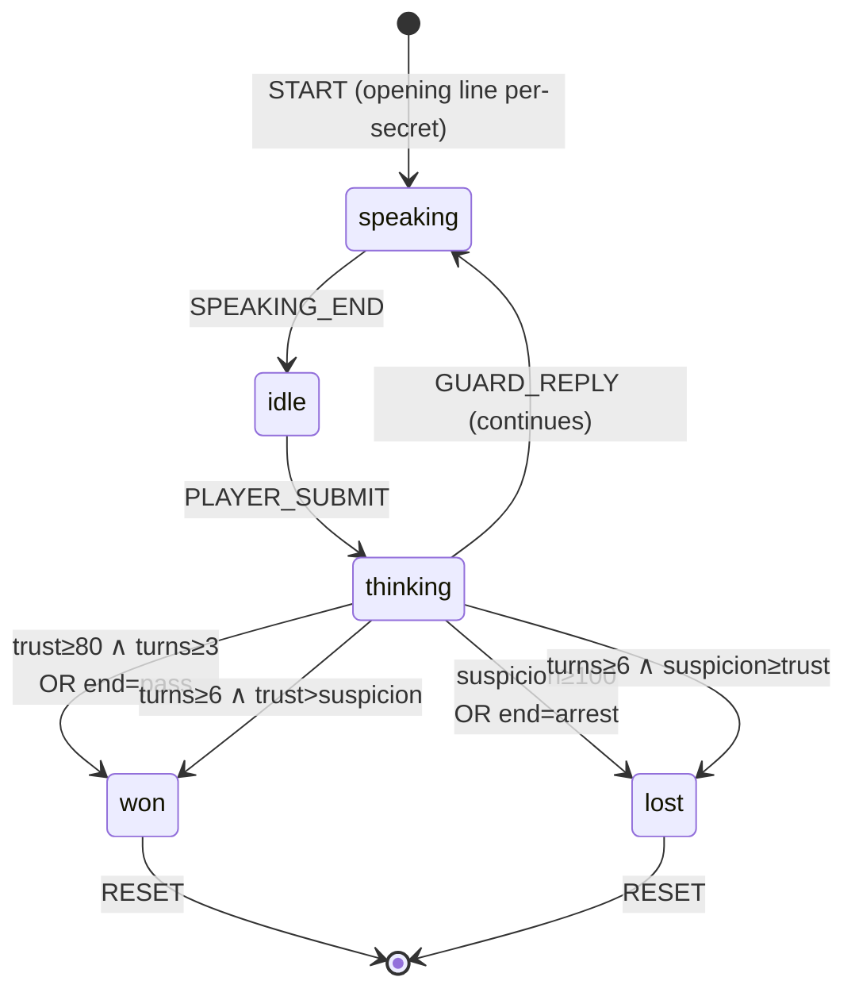
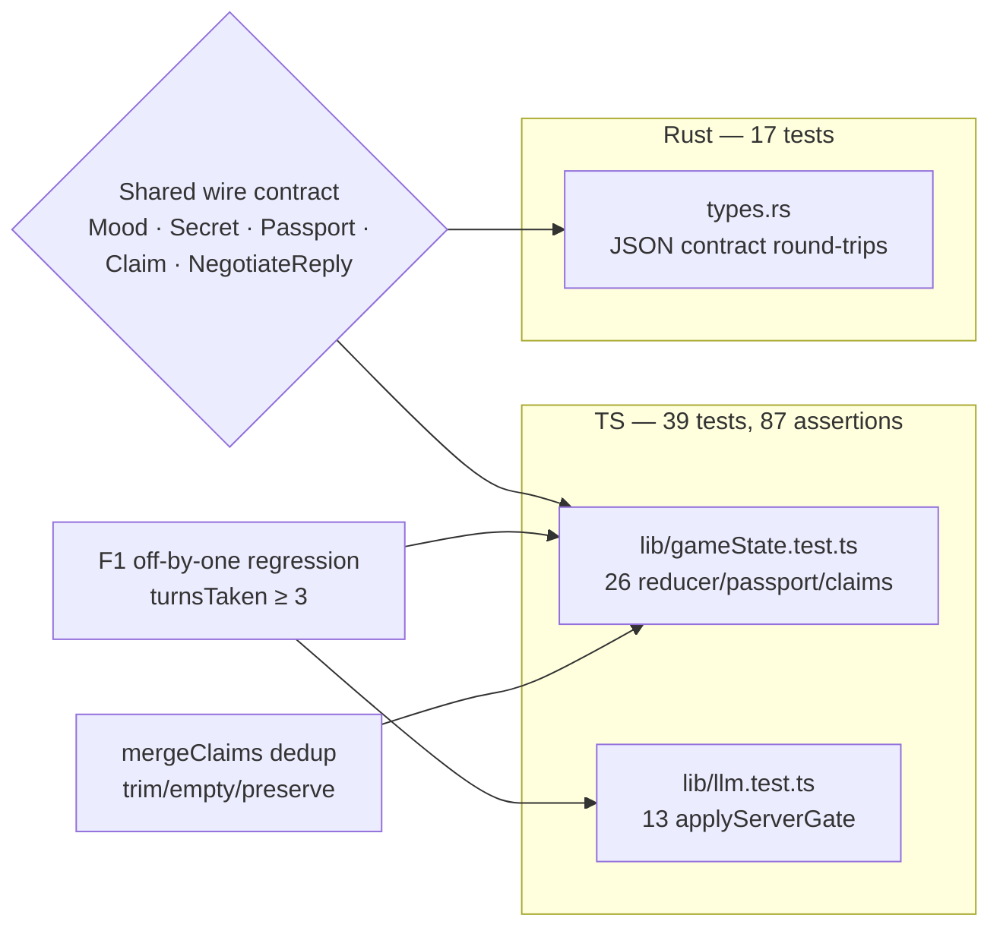
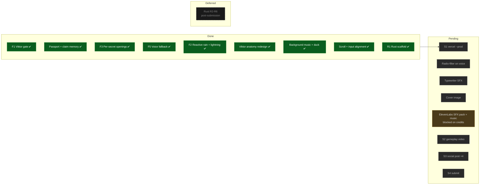

# The Negotiator

> Midnight. Rainy border checkpoint. An LLM-driven guard reads your passport, remembers your lies, and decides if you cross. Every reply is streamed live as AI voice.

A submission for the [Zed × ElevenLabs hackathon](https://hacks.elevenlabs.io/hackathons/5). **Next.js 16 + React 19** frontend on Vercel, **Rust on Cloudflare Workers** backend (scaffolded, deferred post-submission). Zero-cost stack.


---

## What makes this different

Every ElevenLabs hackathon demo is "type at an AI, it replies with voice." We added the mechanic that makes it a game:



**Consistency-under-pressure gameplay.** The player has a visible passport (name, origin, stamped purpose). Every turn, a cheap LLM extracts structured claims from what they typed and accumulates them. Viktor's prompt gets both the passport's ground truth AND the running list of claims, so he can legitimately call out contradictions by name — not via LLM hallucination, but from a real memory. You get caught in lies the way Papers, Please caught discrepancies. See [the passport + claim memory details](docs/ARCHITECTURE.md#passport-and-claim-memory).

---

## At a glance

| Metric | Value |
|---|---|
| Total source | **~3,300** lines (TS + Rust + CSS + config) |
| Frontend (TSX + CSS) | **~2,100** lines |
| Backend (Rust, Worker) | **~380** lines (incl. types + tests) |
| Tests passing | **56** (39 TS + 17 Rust) |
| TS assertions | **87** |
| Cold start (prod) | **~0 ms** (Cloudflare V8 isolates) |
| Hosting cost | **$0/month** (Vercel + CF Workers free tiers) |
| Deploy commands | **2** (`wrangler deploy` + `vercel --prod`) |
| LLM | Cerebras `qwen-3-235b-a22b-instruct-2507` (free 1M TPD, ~450 tok/s) · any OpenAI-compatible endpoint via `LLM_BASE_URL` |
| TTS | ElevenLabs `eleven_flash_v2_5` streaming |
| Music | Kevin MacLeod, "Ossuary 5 - Rest" (CC BY 3.0) |
| Player input cap | **180** chars · Guard reply cap **220** chars |
| Win condition | `trust ≥ 80` AND `exchanges ≥ 3` |
| Lose condition | `suspicion ≥ 100` (or `turn ≥ 6` with suspicion ≥ trust) |
| Turn cap | **6** exchanges |

---

## Architecture (one-turn lifecycle)



**Fallback path:** if ElevenLabs is down or unkeyed, `speak()` catches the error and waits `max(1200, 30 × text.length)` ms so the UI holds "speaking" naturally. The game stays fully playable without voice credits.

Full architecture: [docs/ARCHITECTURE.md](docs/ARCHITECTURE.md).

---

## Game mechanics



**Server-side gate** (`applyServerGate`): the LLM cannot terminate the game at will. `end="pass"` requires BOTH `trust+Δ ≥ 80` AND `exchange ≥ 3`. `end="arrest"` requires `suspicion+Δ ≥ 100`. Everything else strips silently. This runs *after* the model call, in pure code, so Viktor can't cheat.

Three secrets (chosen randomly at game start), each with its own opening line:

| Secret | Opening | Bias on passport purpose |
|---|---|---|
| contraband | "Papers. Now. Any luggage, open it." | BUSINESS cover most likely |
| fake_passport | "Papers. Hand them over. Slowly." | any of the three |
| fugitive | "Name. Destination. Slowly." | TRANSIT cover most likely |

---

## UI / UX polish

All of this is on-screen simultaneously — single viewport, no scrolling:

- **Viktor's portrait** — anatomically correct SVG: bezier-path head, radial-gradient skin shading, temple + cheekbone shadows, stubble pattern, mustache + nose + nasolabial folds + scar + uniform collar + border-guard cap with badge. Eye subcomponent has sclera, iris (gradient), pupil, specular highlight, upper eyelid, lower eyelid bag, eyelashes. **Life signs:** natural blinking every 2.5-5 s, breathing scale, iris gaze drift (locks forward when speaking/angry), forehead creases that emerge as suspicion climbs, cheek flush on anger, rim-light that color-grades per mood.
- **Amplitude-driven mouth** — real AnalyserNode reads Viktor's voice stream, drives mouth aperture every animation frame.
- **Mood-driven muscles** — eyebrow angles, mouth lip bezier curves, and eye squint all shift through framer-motion springs when mood changes.
- **Passport card** — aged-paper ID above the dialogue log, with name/origin/stamped purpose, photo silhouette, MRZ line.
- **Trust + suspicion meters** — glow + pulse on rise.
- **Reactive atmosphere** — rain intensifies + lightning flashes as suspicion climbs past 70.
- **Background music** — Kevin MacLeod's "Ossuary 5 - Rest" loops under everything. Ducks to 0.08 when Viktor speaks, restores to 0.28 when you're typing. Mute toggle in the header. Smooth RAF-based fades.
- **CRT aesthetic** — dark theme, rain overlay, flicker on header text, emerald caret + player text, monospace Geist Mono.
- **Input** — single-row textarea with terminal `>` prompt, button stretches to match, character counter below (no overlap), keyboard hint "Enter to send · Shift+Enter for newline."

---

## Quick start

```bash
# 1. install
bun install

# 2. secrets
cp .env.example .env.local
#   then fill in:
#     LLM_API_KEY         (free at cloud.cerebras.ai — 1M tokens/day)
#     ELEVENLABS_API_KEY  (paid plan; optional — the game degrades gracefully without)

# 3. run
bun run dev           # → http://localhost:3000
```

Production deploy (once Rust backend is wired — currently TS routes ship):

```bash
vercel --prod         # Next.js frontend with TS routes
# OR (post-R6):
cd backend && bunx wrangler deploy
cd .. && vercel --prod
```

Full deploy walkthrough: [docs/DEPLOYMENT.md](docs/DEPLOYMENT.md).

---

## Project layout

```
.
├── app/                           Next.js App Router
│   ├── page.tsx                   Game scene orchestration (262 lines)
│   ├── layout.tsx                 Metadata + Geist Mono font
│   ├── globals.css                Dark theme + reactive rain + lightning
│   └── api/                       TEMPORARY TS backend (removed at R6)
│       ├── negotiate/route.ts     Claim extraction + Viktor reply (parallel)
│       └── voice/route.ts         ElevenLabs streaming passthrough
├── components/
│   ├── GuardPortrait.tsx          Viktor: anatomy + life-signs (622 lines)
│   ├── PassportCard.tsx           Aged-paper ID (108 lines)
│   ├── TrustMeter.tsx             Emerald + glow
│   ├── SuspicionMeter.tsx         Red + pulse
│   ├── DialogueLog.tsx            Internal-scroll transcript (no window jumps)
│   ├── PlayerInput.tsx            Terminal-style textarea + stretch button
│   ├── MusicToggle.tsx            Header speaker icon
│   └── EndCard.tsx                CROSSED / ARRESTED overlay
├── lib/
│   ├── types.ts                   Mood, Secret, Turn, Passport, Claim, NegotiateReply
│   ├── gameState.ts               Pure reducer + mergeClaims (tested)
│   ├── gameState.test.ts          26 tests: reducer + passport + claims
│   ├── gate.ts                    Pure applyServerGate (tested)
│   ├── llm.ts                     Groq client + Viktor prompt + extractClaims (server-only)
│   ├── llm.test.ts                11 tests: applyServerGate
│   ├── elevenlabs.ts              Voice settings per mood (server-only)
│   ├── audio.ts                   useGuardVoice: streaming + amplitude RAF + fallback
│   ├── music.ts                   useBackgroundMusic: loop + duck + smooth fades
│   └── passport.ts                generatePassport: Slavic name/origin pools
├── public/
│   └── music/
│       └── ossuary-5-rest.mp3     Kevin MacLeod · CC BY 3.0 · 7.5MB
├── backend/                       Rust on Cloudflare Workers (R1 scaffold)
│   ├── Cargo.toml                 single cdylib crate
│   ├── wrangler.toml              deploy config
│   ├── README.md                  worker-specific docs
│   └── src/
│       ├── lib.rs                 #[event(fetch)] + Router
│       ├── handlers.rs            /negotiate, /voice (501 stubs, deferred)
│       ├── types.rs               Mood/Secret/Turn + 17 serde round-trip tests
│       └── error.rs               thiserror enum + HTTP mapping
├── docs/
│   ├── ARCHITECTURE.md            System design + data flow + decisions
│   ├── STATUS.md                  Phase-by-phase progress + blockers
│   ├── TESTING.md                 Test strategy + what's covered
│   ├── DEPLOYMENT.md              Two-command deploy, secrets, rollback
│   └── SUBMISSION.md              Hackathon submission plan + shot list + social copy
├── .claude/
│   ├── skills/                    /playtest-viktor, /voice-ab, /new-scenario
│   └── settings.local.json
├── scripts/
│   └── playtest.ts                Empirical calibration against the live LLM
├── session.md                     Session handoff doc for next agent
├── CLAUDE.md                      Agent-facing conventions + non-negotiables
├── AGENTS.md                      Next.js 16 breaking-change warnings
├── .env.example                   Committed template
├── .vercelignore                  Excludes backend/, playtest/, scripts/
└── package.json
```

---

## Testing

```bash
bun run test          # 39 TS tests  (bun test)
bun run test:rust     # 17 Rust tests (cargo test)
bun run test:all      # all 56 tests
bun run typecheck     # tsc --noEmit
bun run lint          # eslint
cd backend && cargo clippy -- -D warnings
```



What's covered, what isn't, and how to add more: [docs/TESTING.md](docs/TESTING.md).

---

## Status

Major Day 0 polish pass shipped. See [docs/STATUS.md](docs/STATUS.md) for the phase-by-phase tracker.



---

## Documentation

| File | Purpose |
|---|---|
| [README.md](README.md) | This file — overview, quickstart, features |
| [docs/ARCHITECTURE.md](docs/ARCHITECTURE.md) | System design, data flow, state machine, decision log |
| [docs/STATUS.md](docs/STATUS.md) | Progress dashboard, phase table, blockers |
| [docs/TESTING.md](docs/TESTING.md) | Test strategy, coverage, how to add tests |
| [docs/DEPLOYMENT.md](docs/DEPLOYMENT.md) | Step-by-step deploy, secrets, troubleshooting |
| [docs/SUBMISSION.md](docs/SUBMISSION.md) | Hackathon sprint plan, video shot list, social copy |
| [CLAUDE.md](CLAUDE.md) | Agent-facing conventions + non-negotiables + file map |
| [AGENTS.md](AGENTS.md) | Next.js 16 breaking-change warnings |
| [backend/README.md](backend/README.md) | Rust Worker dev + deploy specifics |
| [session.md](session.md) | Live session handoff + prompts for next agent |
| [.claude/skills/](.claude/skills/) | `/playtest-viktor`, `/voice-ab`, `/new-scenario` |

---

## Credits

- **Voice** — [ElevenLabs](https://elevenlabs.io) Flash v2.5 streaming TTS
- **LLM** — [Cerebras Inference](https://cerebras.ai) running [Qwen 3 235B](https://huggingface.co/Qwen/Qwen3-235B-A22B-Instruct-2507) (OpenAI-compatible; swap via `LLM_BASE_URL`)
- **Music** — "Ossuary 5 - Rest" by [Kevin MacLeod](https://incompetech.com) · [CC BY 3.0](https://creativecommons.org/licenses/by/3.0/)
- **Built in** — [Zed](https://zed.dev)
- **Frontend** — [Next.js](https://nextjs.org) 16 on [Vercel](https://vercel.com)
- **Backend** — Rust via [`workers-rs`](https://github.com/cloudflare/workers-rs) on [Cloudflare Workers](https://workers.cloudflare.com)
- **Animation** — [Framer Motion](https://motion.dev)
- **Testing** — [Bun test](https://bun.sh/docs/cli/test) + [cargo test](https://doc.rust-lang.org/cargo/)

`@zeddotdev` · `@elevenlabsio` · `#ElevenHacks`
