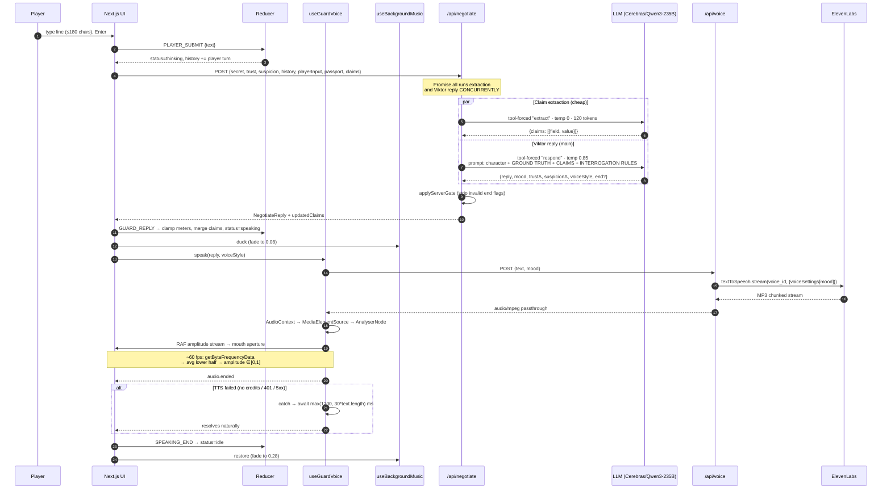
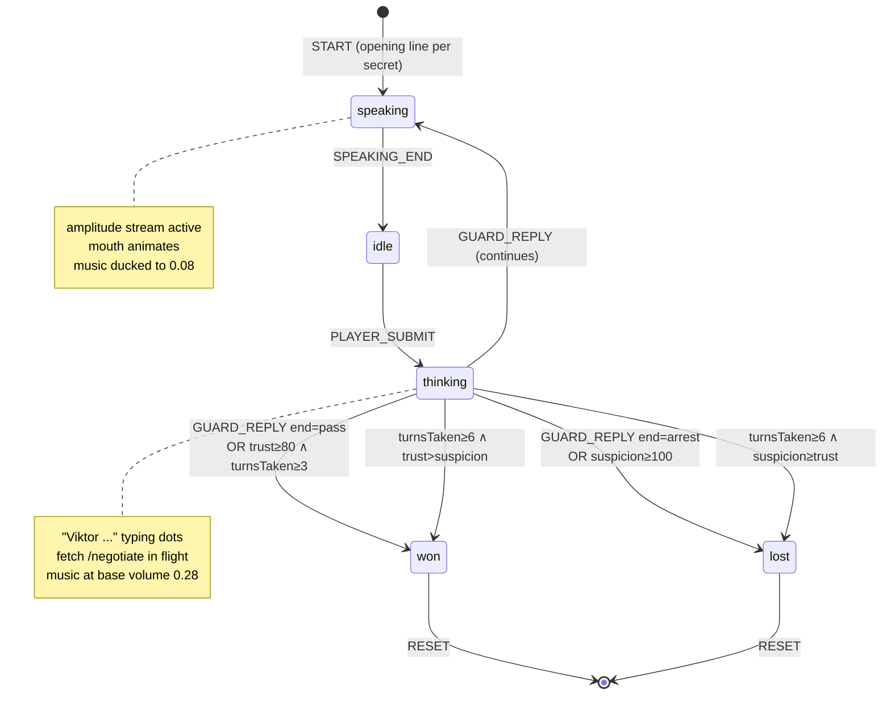

# Architecture

## System topology

```mermaid
flowchart TB
    subgraph client[Client — runs in browser]
        UI[Next.js page.tsx<br/>client component]
        R[Reducer<br/>pure gameState.ts]
        GV[useGuardVoice hook<br/>AudioContext + AnalyserNode]
        BM[useBackgroundMusic hook<br/>HTMLAudioElement + RAF fades]
        UI <--> R
        UI <--> GV
        UI <--> BM
    end

    subgraph vercel[Vercel Edge Network]
        CDN[Static assets + HTML + /public/music]
    end

    subgraph server[Next.js API routes — temp TS backend]
        N[/api/negotiate<br/>claim-extract + Viktor reply<br/>Promise.all]
        V[/api/voice<br/>TTS streaming passthrough]
    end

    subgraph cf[Cloudflare Workers — deferred]
        RT[Rust Worker<br/>R1 scaffold, 501 stubs]
    end

    subgraph ext[External APIs]
        LLM[OpenAI-compatible LLM<br/>Cerebras · Qwen 3 235B default<br/>LLM_BASE_URL / LLM_MODEL override]
        ELEVEN[ElevenLabs<br/>Flash v2.5 TTS]
    end

    UI -->|fetch HTML + JS + music| CDN
    UI -->|POST /negotiate| N
    UI -->|POST /voice| V
    N -->|chat.completions<br/>two tool calls| LLM
    V -->|textToSpeech.stream| ELEVEN
    ELEVEN -.->|MP3 bytes| V

    N -. future .-> RT
    V -. future .-> RT
    RT -. future .-> LLM
    RT -. future .-> ELEVEN
```

Two deployment targets, one codebase:

| Tier | Platform | Contents | Free quota |
|---|---|---|---|
| Frontend | Vercel | Next.js app + TS API routes + `public/music/` | 100 GB bandwidth/mo |
| Backend (future) | Cloudflare Workers | Rust compiled to WASM via workers-rs | 100 k req/day |

---

## One-turn data flow



---

## Passport and claim memory

The gameplay differentiator — the piece that lifts this above "type at an AI, it replies with voice" into real gameplay.

```mermaid
flowchart TB
    subgraph init[Game start]
        GP[generatePassport<br/>lib/passport.ts]
        GP -->|Name, Origin, Purpose, photoSeed| ST[(state.passport<br/>+ state.claims = [])]
    end

    subgraph turn[Every turn]
        IN[Player input]
        IN --> EX[extractClaims<br/>lib/llm.ts · LLM tool call · temp 0]
        EX -->|new claims| MRG[mergeClaims<br/>by field, dedup, trim]
        ST -->|prior claims| MRG
        MRG --> NST[(next state.claims)]

        ST -->|ground truth| VP[Viktor prompt<br/>GROUND TRUTH block]
        ST -->|prior claims| VP
        IN -->|current input| VP
        VP --> REPLY[Viktor's reply +<br/>deltas + end?]
    end

    classDef input fill:#1e3a5f,color:#fff
    classDef memory fill:#7a1a14,color:#fff
    classDef compute fill:#2a2a2a,color:#bbb
    class IN input
    class ST,NST memory
    class EX,MRG,VP compute
```

**Design intent:** Viktor shouldn't *guess* that you're lying — he should *know*, because he's carrying structured evidence. The passport is ground truth the player can see. The claim store is a running list of what the player has explicitly told him. When the current input contradicts either, the system prompt instructs Viktor to call out the specific contradiction and apply a suspicion delta.

**Critical design choice:** the two LLM calls run **concurrently** via `Promise.all` in `app/api/negotiate/route.ts`. Serial would add ~150-300 ms to the critical path. Parallel keeps turn latency inside one round-trip budget. Extraction failures are swallowed (extractor returns `[]`), so a broken extract never breaks the main reply path.

**Stateless server preserved:** the server holds no game state. Passport + claims live on the client reducer; client sends both every turn.

### Claim merge rules (`mergeClaims` in `lib/gameState.ts`)

- Merge by field — latest value for any given field wins. Prior turns have already been fed to earlier prompts, so the interrogation memory is preserved; the store holds "last known answer" per field.
- Trim whitespace, drop empty values.
- Pass-through when incoming is empty (returns the same reference).

### Prompt blocks (`lib/llm.ts`)

```
GROUND TRUTH (what the passport in front of you says):
  - Name: Anna Kowalczyk
  - Origin: Warsaw
  - Purpose: BUSINESS

PLAYER CLAIMS SO FAR:
  - name: "Ana"
  - purpose: "family"

INTERROGATION RULES:
- Contradicts passport on a specific field → name it + suspicionDelta +10..+15
- Contradicts a prior claim → name both + suspicionDelta +15..+20
- Matches the passport on an asked field → trustDelta +5..+8
- Never invent contradictions. Only call out real ones.
```

---

## Game state machine



---

## Module responsibilities

| Module | Runs on | Role | Tests |
|---|---|---|---|
| `app/page.tsx` | Browser | Orchestration — dispatch actions, call speak(), start music on gesture, duck/restore on status change | — |
| `components/GuardPortrait.tsx` | Browser | Illustrated anatomical SVG + mood-driven muscles + life signs (blink, breathe, gaze) | — |
| `components/PassportCard.tsx` | Browser | Aged-paper ID card rendering `Passport` | — |
| `components/TrustMeter.tsx` · `SuspicionMeter.tsx` | Browser | Meters + glow + pulse-on-rise | — |
| `components/DialogueLog.tsx` | Browser | Internal-scroll transcript (`containerRef.scrollTop`, never bubbles to window) | — |
| `components/PlayerInput.tsx` | Browser | Terminal-style textarea + stretch SEND + counter + hint | — |
| `components/MusicToggle.tsx` | Browser | Header speaker icon | — |
| `components/EndCard.tsx` | Browser | CROSSED / ARRESTED overlay with replay | — |
| `lib/gameState.ts` | Browser (pure) | Reducer: deltas, clamp, win/lose, `mergeClaims` | 28 |
| `lib/gate.ts` | Pure TS / Worker (ported) | `applyServerGate` — strip invalid end flags | 11 |
| `lib/llm.ts` | Next.js server (temp) | OpenAI-compatible client (defaults Cerebras / Qwen 3 235B) + Viktor prompt + `extractClaims` | — (gate extracted) |
| `lib/elevenlabs.ts` | Next.js server (temp) | Voice settings per mood + streaming call | — |
| `lib/audio.ts` | Browser | `useGuardVoice` — streaming fetch + AnalyserNode + **graceful fallback** | — (DOM-dependent) |
| `lib/music.ts` | Browser | `useBackgroundMusic` — looping `HTMLAudioElement` + smooth RAF fades + duck/mute | — (DOM-dependent) |
| `lib/passport.ts` | Pure TS | `generatePassport(secret)` — Slavic name + origin pools, secret-biased purpose | — (indirectly via gameState tests) |
| `backend/src/types.rs` | Rust Worker | Mirror TS types, camelCase JSON | 17 |
| `backend/src/llm.rs` | Rust Worker | (R2) port of lib/llm.ts + gate + extractClaims | pending |
| `backend/src/tts.rs` | Rust Worker | (R3) port of lib/elevenlabs.ts | pending |
| `backend/src/handlers.rs` | Rust Worker | HTTP → typed call (501 stubs currently) | — |
| `backend/src/error.rs` | Rust Worker | thiserror enum → `Response::error` with correct status | — |

---

## Data contracts

The wire format between browser and server. Mirrored manually between TS and Rust; drift is caught by the Rust `types::tests` suite.

### POST `/api/negotiate`

**Request (camelCase JSON):**
```ts
{
  secret: "contraband" | "fake_passport" | "fugitive"
  trust: number           // 0..100
  suspicion: number       // 0..100
  history: Turn[]         // NOT including the current player input
  playerInput: string     // ≤180 chars, the current turn
  passport: Passport      // { name, origin, purpose, photoSeed }
  claims: Claim[]         // accumulated claims from prior turns
}

Passport = {
  name: string            // e.g. "Anna Kowalczyk"
  origin: string          // e.g. "Warsaw"
  purpose: "BUSINESS" | "FAMILY" | "TRANSIT"
  photoSeed: number       // drives silhouette tone
}

Claim = {
  field: "name" | "purpose" | "origin" | "relation"
  value: string
}
```

**Response:**
```ts
{
  reply: string                 // ≤220 chars, spoken dialogue only
  mood: Mood                    // "calm" | "suspicious" | "angry" | "amused"
  trustDelta: number            // -20..+20
  suspicionDelta: number        // -20..+20
  voiceStyle: Mood
  end?: "pass" | "arrest"       // omitted unless gate passes
  updatedClaims?: Claim[]       // newly extracted claims from this turn's input
  fallback?: true               // set on catastrophic error; client keeps playing
}
```

**Server-side gate (`applyServerGate`):**
- `end="pass"` requires **BOTH** `trust + trustDelta ≥ 80` AND `exchange ≥ 3`.
- `end="arrest"` requires `suspicion + suspicionDelta ≥ 100`.
- `end="none"` is a schema sentinel (many LLM providers strict-validate tool args and reject optional enum fields) and silently stripped.
- All violations strip the field rather than rewriting it. Pure function.

**Error envelopes** (important for client robustness — the reducer must not receive undefined deltas):
- Non-OK response → client skips dispatch, goes straight to `SPEAKING_END`.
- Payload shape check (`typeof reply === "string"` AND numeric deltas AND mood present) — same bail-out.
- 429 → `{error: "rate_limited", retryAfter: string}` with `retry-after` header.

### POST `/api/voice`

**Request:**
```ts
{ text: string, mood: Mood }
```

**Response:** `audio/mpeg` byte stream (MP3 chunks). Collected into Blob by client, played via `HTMLAudioElement`, routed through `MediaElementSource → BiquadFilter (future) → AnalyserNode` for amplitude sampling that drives mouth animation.

**Fallback:** when this endpoint fails (401 invalid key, 5xx, credit exhausted), `speak()` catches the error and holds the UI "speaking" state for `max(1200, 30 × text.length)` ms via `await new Promise(setTimeout)`. Game stays playable without TTS.

---

## Client hooks

### `useGuardVoice()` — `lib/audio.ts`

Returns `{ speak, amplitude }`. Lifecycle:

1. Mount: creates a single `HTMLAudioElement`, stored in a ref.
2. `ensureCtx()` lazily constructs `AudioContext + MediaElementSource + AnalyserNode` on first `speak()` call (must be after user gesture per browser policy).
3. `speak(text, mood)` — guards against empty text, fetches `/api/voice`, blobs the response, assigns to `audio.src`, plays. On `ended` event, resolves. On any error (network, 4xx, 5xx, playback), catches and awaits a read-time delay.
4. While playing: RAF loop reads `analyser.getByteFrequencyData()`, averages lower half of spectrum, writes normalized `amplitude` state. Component consumers (GuardPortrait) re-render their mouth geometry.
5. Unmount: pause audio, cancel RAF, close context (safely).

### `useBackgroundMusic(src)` — `lib/music.ts`

Returns `{ start, duck, restore, toggleMute, muted, started }`. Lifecycle:

1. Mount: creates a single `HTMLAudioElement` with `loop=true`, `preload="auto"`, initial volume 0.
2. `start()` — must be called from a user gesture (click handler). Plays the audio and fades up to `0.28` (base volume).
3. `duck()` — fades to `0.08` over 350 ms via RAF. No-op when muted.
4. `restore()` — fades back to `0.28`. No-op when muted.
5. `toggleMute()` — hard override. Fades to `0` when muting, back to `0.28` when unmuting. Beats duck/restore.
6. Smooth volume transitions use a single RAF loop cancelled + restarted on each fade target. `performance.now()` anchors the curve.
7. Unmount: pause audio, cancel RAF.

Base/duck constants live at the top of `lib/music.ts` — change in one place.

---

## Why this stack

Every component was picked for exactly one reason. Cuts are documented so a future agent doesn't re-propose them.

| Choice | Why | Alternative considered |
|---|---|---|
| Next.js 16 on Vercel | Native Next platform; free tier; one-command deploy | Astro, Remix (less common for hackathons) |
| Rust on Cloudflare Workers (future) | First-party `workers-rs`; **zero cold-start** V8 isolates; 100k req/day free; secrets as `wrangler secret put` | Fly.io (no free tier since Q4 2024); Render (30-60 s Rust cold starts); AWS Lambda (stateless + DynamoDB needed); Oracle Cloud (instance reclaim risk) |
| Cerebras + Qwen 3 235B (default) | Most generous free tier in 2026 (**1M TPD, 60K TPM**), OpenAI-compatible drop-in, 235B MoE is ~14× the params of Llama 4 Scout 17B so Viktor's character is sharper and contradiction-catching is more reliable. Code uses `openai` SDK with `baseURL` override, so swapping providers is a one-env-var change. | Groq (smaller free ceiling), Gemini 2.5 Pro (100 RPD kills playability), Claude API (no free API tier), OpenAI GPT-4o-mini (paid) |
| Two-LLM pipeline (extract + reply) | Extraction needs cold precision (temp=0, tiny schema); reply needs warm character (temp=0.85). Running concurrent keeps latency flat. | Single-call with combined schema (pollutes Viktor's output quality) |
| ElevenLabs Flash v2.5 | Fastest ElevenLabs model (~500 ms first byte); mood→voice-settings mapping | Turbo v2.5 (slower); Multilingual v2 (slower still); v3 (deferred to when credits arrive) |
| Kevin MacLeod "Ossuary 5 - Rest" | CC BY 3.0 royalty-free, dark ambient drone, 2:26 loops cleanly, sits under dialogue | ElevenLabs Music generation (blocked on credits) — planned swap later |
| Bun for dev + tests | Native TS, native test runner, fastest install | Vitest + Node (more setup); Jest (slow) |
| Tailwind v4 | Current major; dark CRT aesthetic fits utility classes | CSS modules (more boilerplate) |
| Framer Motion | Imperative + declarative animation; `useAnimationControls` for meter pulses; springs on every mood-driven SVG attribute | GSAP (overkill); Motion One (less ergonomic) |
| SVG Viktor (not Rive / Lottie / 3D) | Keeps CRT/noir aesthetic, zero new deps, precise per-feature control | Rive (~150 KB + authoring burden); Lottie (aesthetic mismatch with pre-made packs); Three.js avatar (700 KB, style mismatch) |

---

## What we are NOT building (and why)

A permanent list so new agents don't re-propose these.

| Rejected | Reason |
|---|---|
| Server-side game sessions / DashMap | Client holds state (~800 bytes with passport+claims); stateless fits serverless. |
| WebSocket duplex | Turn-based game doesn't need pushes. HTTP request/response is the right shape. |
| Server-side audio DSP (radio filter) | Requires native crates → kills WASM Worker deploy. Future path: Rust → WASM AudioWorklet on the *client*. |
| `ts-rs` generated types | Two enums + two structs, mirror them by hand. Type tests catch drift. |
| Docker / multi-stage builds / distroless | No containers in this project. |
| Cargo workspace with 3 crates | One binary crate is enough. Future `playtest/` CLI is separate. |
| `governor` + `moka` + `tower-http` | CF edge provides rate limiting + KV for caching when needed. |
| Server-authoritative state | Over-engineered for turn-based. |
| Rive / Lottie / Three.js character | Portrait aesthetic is load-bearing; redesigned SVG is cheaper and matches. |
| Ambient audio asset files (`rain.mp3`) | Synthesize in-browser via Web Audio API when we add ambience. Kevin MacLeod MP3 is a *composed* music bed, not ambience. |
| Move to Fly.io / Render / Railway / AWS / GCP / Oracle | Relitigated already. CF Workers + Vercel = best-free tier. |
| Second scenario before scenario 1 is recorded | `.claude/skills/new-scenario/` gate refuses to scaffold until scenario 1 is video-ready. |

---

## Constants that matter

| Constant | Where | Value |
|---|---|---|
| Player input cap | `components/PlayerInput.tsx`, server | 180 chars |
| Guard reply cap | tool schema + post-slice in `lib/llm.ts` | 220 chars |
| History sent to LLM | `lib/llm.ts` | last 6 turns |
| Starting trust | `lib/gameState.ts:createInitialState` | 35 |
| Starting suspicion | same | 35 |
| Turn cap | same | 6 |
| Win trust threshold | reducer + `applyServerGate` | 80 |
| Lose suspicion threshold | same | 100 |
| Minimum exchanges for pass | `applyServerGate` | 3 |
| LLM temperature (reply) | `lib/llm.ts` | 0.85 |
| LLM temperature (claim extract) | `lib/llm.ts` | 0 |
| LLM max_tokens (reply) | same | 250 |
| LLM max_tokens (claim extract) | same | 120 |
| Default voice ID | `lib/elevenlabs.ts` | `pNInz6obpgDQGcFmaJgB` (Adam) — will be A/B'd |
| TTS model | same | `eleven_flash_v2_5` |
| Output format | `/api/voice` | `mp3_44100_128` |
| Background music base volume | `lib/music.ts` | 0.28 |
| Background music duck volume | `lib/music.ts` | 0.08 |
| Volume fade duration | `lib/music.ts` | 350 ms |
| TTS fallback read delay | `lib/audio.ts` | `max(1200, 30 × text.length)` ms |
| Blink interval | `components/GuardPortrait.tsx` | random 2500-5000 ms, 140 ms duration |
| Breathing period | same | 3.6 s idle / 0.9 s speaking |
| Rain heavy overlay opacity | `app/globals.css` | scales with `--suspicion-level` |
| Lightning threshold | `app/page.tsx` | suspicion ≥ 70 |

Change any of these in **one** place. The type tests + reducer tests will tell you if you broke a contract.
