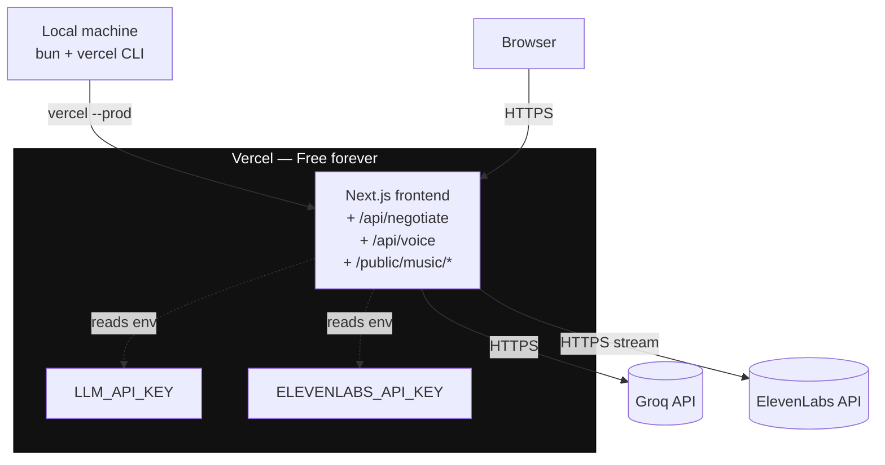
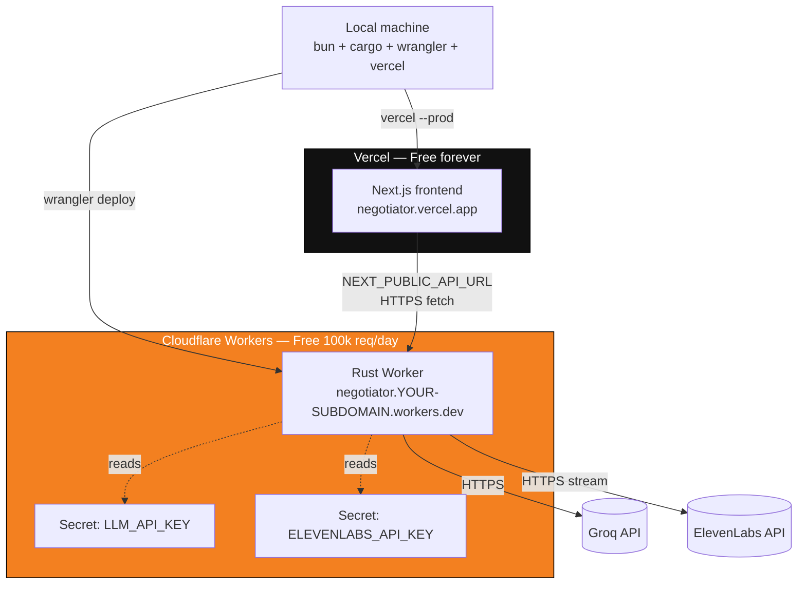

# Deployment

Two deployment modes:

- **Current (pre-submission):** single-tier Vercel deploy. TS API routes under `app/api/*` handle both LLM + TTS. This is what ships to hackathon judges.
- **Future (post-submission):** two-tier Vercel + Cloudflare Workers. Rust Worker replaces the TS routes. Same frontend.

## Topology (current, pre-submission)



## Topology (future, post-R6)



## Cost

```
Vercel (frontend + TS API routes) : $0/month
Cloudflare Workers (future)        : $0/month (100k req/day free tier)
Groq                               : $0 (free tier, 12k TPM)
ElevenLabs                         : user's existing paid plan
DNS / domain                       : $0 (*.vercel.app + *.workers.dev)
Music asset                        : $0 (CC BY 3.0, Kevin MacLeod)
─────────────────────────────────
Total hosting cost                 : $0/month
```

## Prerequisites

Install once per machine:

```bash
# Bun (TS runtime + tests + install)
curl -fsSL https://bun.sh/install | bash

# Vercel CLI
bun add -g vercel    # or: npm i -g vercel

# For the future Rust backend (R2+):
curl --proto '=https' --tlsv1.2 -sSf https://sh.rustup.rs | sh
rustup target add wasm32-unknown-unknown
# Cloudflare wrangler is invoked via bunx — no global install needed
```

API keys:

- **LLM (default Cerebras)** — https://cloud.cerebras.ai (free, 1M tokens/day, no credit card). Override via `LLM_BASE_URL` + `LLM_MODEL` to use Groq / OpenAI / OpenRouter / etc.
- **ElevenLabs** — https://elevenlabs.io/app/settings/api-keys (user's paid plan)

## Current deploy (TS backend ships)

### One-time Vercel setup

```bash
cd /path/to/game

# Link to a Vercel project — opens browser
vercel link

# Set env vars — pasted when prompted, never shown again
vercel env add LLM_API_KEY production
vercel env add ELEVENLABS_API_KEY production

# Optional: override the default LLM provider (Cerebras + Qwen 3 235B)
# vercel env add LLM_BASE_URL production
# vercel env add LLM_MODEL production

# Also add for preview deploys if you want the preview URL to work
vercel env add LLM_API_KEY preview
vercel env add ELEVENLABS_API_KEY preview
```

### Ship

```bash
vercel --prod
```

Finishes in **under 60 seconds** on a warm network. Writes a production URL like `https://the-negotiator-abc123.vercel.app`.

### Vercel-specific notes

- `.vercelignore` excludes `backend/`, `playtest/`, and `scripts/` — Vercel should only build the Next.js app.
- `public/music/ossuary-5-rest.mp3` (7.5 MB) ships as a static asset. First-load cost is a one-time CDN fetch; played back in a streaming `HTMLAudioElement`.
- Turbopack is only used in dev. Production build is the default Next.js 16 production pipeline.
- The `app/api/*` routes run on Vercel's Node runtime. `export const runtime = "nodejs"` is set explicitly in each file.

## Smoke test the deploy

```bash
# 1. Frontend
open https://<your-deploy>.vercel.app
# incognito + mobile Safari check before posting the link publicly

# 2. Negotiate endpoint
curl -X POST https://<your-deploy>.vercel.app/api/negotiate \
  -H 'content-type: application/json' \
  -d '{
    "secret":"contraband",
    "trust":35,
    "suspicion":35,
    "history":[],
    "playerInput":"just visiting my mother",
    "passport":{"name":"Anna Kowalczyk","origin":"Warsaw","purpose":"BUSINESS","photoSeed":42},
    "claims":[]
  }'

# 3. Voice endpoint
curl -X POST https://<your-deploy>.vercel.app/api/voice \
  -H 'content-type: application/json' \
  -d '{"text":"Papers.","mood":"suspicious"}' \
  --output viktor.mp3
afplay viktor.mp3    # macOS
```

## Observability

```bash
# Vercel deployment + runtime logs
vercel logs <your-deploy>.vercel.app

# Or open the Vercel dashboard → project → Deployments / Logs
open https://vercel.com/dashboard
```

## Rollback

Vercel keeps every deploy. Promote a previous one from the dashboard (Deployments → "⋯" → "Promote to Production") or:

```bash
vercel promote <PREVIOUS_DEPLOYMENT_URL> --prod
```

## Future: Cloudflare Worker deploy (post-R6)

### One-time

```bash
cd backend

# Authenticate once — opens browser to cloudflare.com
bunx wrangler login

# Set secrets — pasted at the prompt
bunx wrangler secret put LLM_API_KEY
bunx wrangler secret put ELEVENLABS_API_KEY
bunx wrangler secret put ELEVENLABS_VOICE_ID   # optional override
# Optional: swap LLM provider from the Cerebras default
# bunx wrangler secret put LLM_BASE_URL
# bunx wrangler secret put LLM_MODEL
```

First `wrangler deploy` creates the Worker and prints its URL:

```
https://negotiator.<your-cloudflare-subdomain>.workers.dev
```

### Routine

```bash
# backend
cd backend && bunx wrangler deploy

# frontend
cd .. && vercel --prod
```

### Frontend env var (post-R6)

After switching to the Worker, add:

```bash
vercel env add NEXT_PUBLIC_API_URL production
# value: https://negotiator.<your-cloudflare-subdomain>.workers.dev
```

Then redeploy the frontend.

## Troubleshooting

| Symptom | Likely cause | Fix |
|---|---|---|
| Vercel build fails on `backend/` folder | `.vercelignore` missing or wrong | Ensure `backend/`, `playtest/`, `scripts/` are listed |
| `/api/voice` returns 500, log shows `invalid_api_key` | `ELEVENLABS_API_KEY` is blank / expired / wrong | Update via `vercel env add`, redeploy. Voice fallback (F5) keeps game playable in the meantime |
| `/api/negotiate` returns 429 | LLM provider rate limit (TPM or daily TPD). Amber banner appears in the UI. | Expected during heavy playtests. Cerebras Qwen 3 235B default gives 60K TPM / 1M TPD — enough for normal play. Override model via `LLM_MODEL` if you need something bigger or smaller. |
| Audio doesn't autoplay | Browser autoplay policy — music requires a user gesture | Wired correctly: music starts on "Approach the Gate" click |
| Music file 404 | `.vercelignore` or Vercel build missing `public/music/` | Check the file exists in the deployed build, confirm Vercel is serving `/music/ossuary-5-rest.mp3` |
| Portrait SVG shows NaN warnings | Malformed response payload poisoning state | Fixed — client now checks `res.ok` + shape-validates before dispatching |
| `wrangler deploy` fails with "Account required" | Not logged in | `bunx wrangler login` |
| Rust `cargo check --target wasm32-unknown-unknown` fails | `wasm32` target missing | `rustup target add wasm32-unknown-unknown` |
| Worker cold start slow | Should never happen on CF V8 isolates | File a Cloudflare ticket |

## Custom domain (optional)

- **Vercel**: dashboard → Settings → Domains → add `negotiator.yourdomain.com`.
- **Cloudflare** (post-R6): dashboard → Workers → negotiator → Custom Domains → `api.yourdomain.com`, then update `NEXT_PUBLIC_API_URL`.

Not required for hackathon submission — `*.vercel.app` is fine.

## What survives a torn-down laptop

Everything. Worker code + frontend code + deploy config + secrets all live in Cloudflare/Vercel. On a fresh machine:

```bash
git clone <repo>
cd game && bun install
vercel link                       # re-link
cd backend && bunx wrangler login # re-auth (post-R6)
```

Then the routine deploy works.

No Docker image to restore, no VM to reconfigure.
