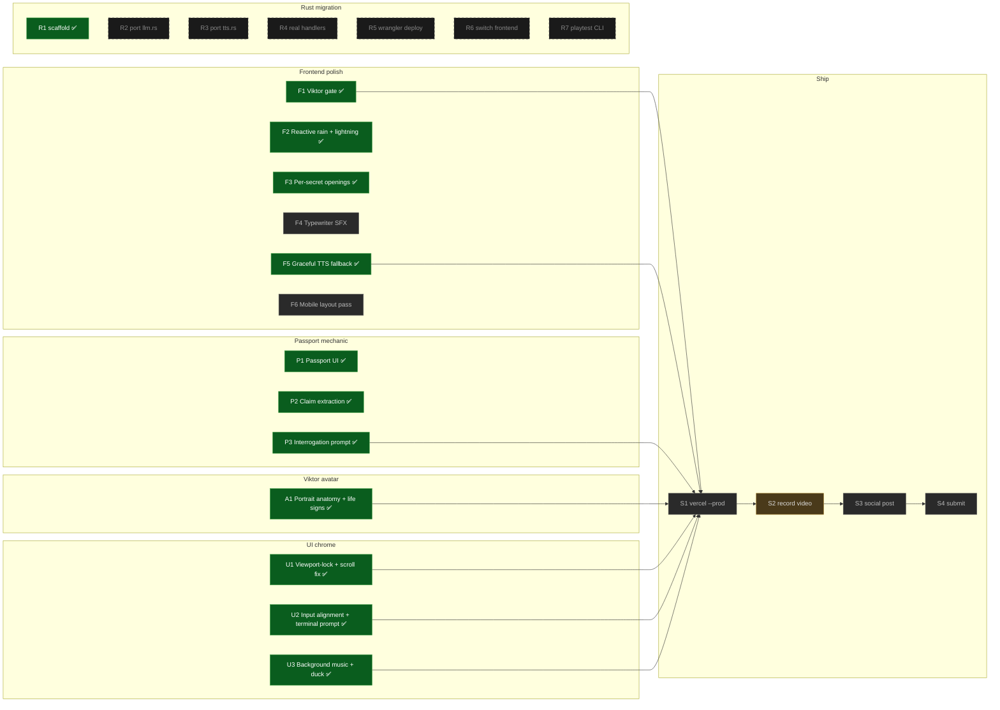
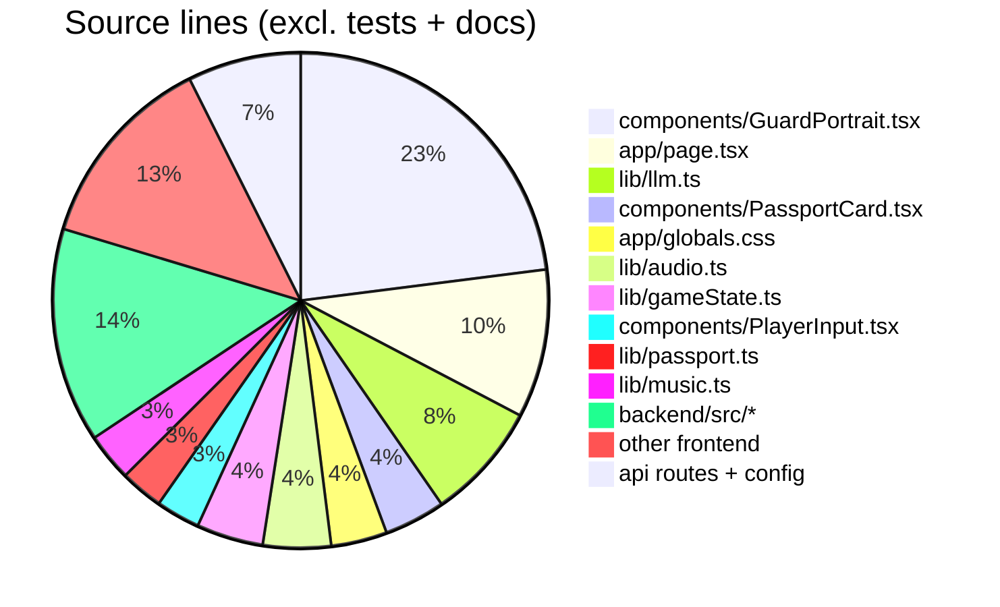
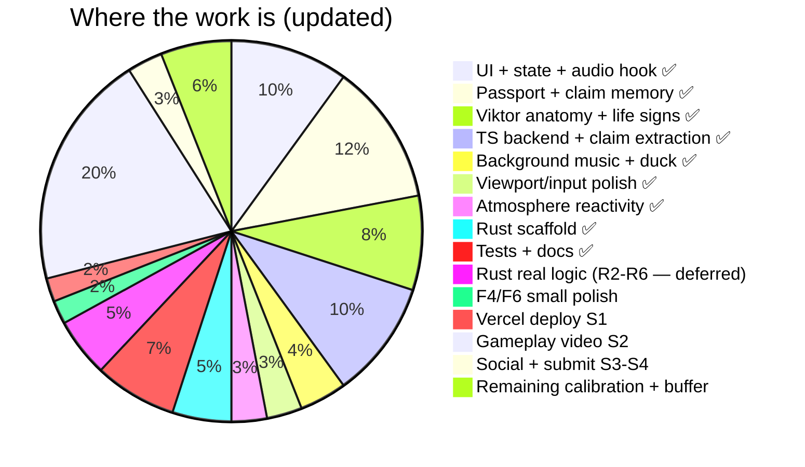

# Status

> Single source of truth for "how far along are we." Updated as phases land.

## Dashboard

| Metric | Value |
|---|---|
| Phases defined | **24** (F1–F6 · P1–P3 · A1 · U1–U3 · R1–R7 · S1–S4) |
| Phases complete | **12** (F1 · F2 · F3 · F5 · P1 · P2 · P3 · A1 · U1 · U2 · U3 · R1) |
| Phases remaining | **12** |
| Weighted completion | **≈72 %** toward a shippable submission |
| Source lines | **~3,300** (TS + Rust + CSS + config) |
| Tests passing | **56** (39 TS + 17 Rust) |
| TS assertions | **87** |
| Typecheck | ✅ |
| Lint (eslint) | ✅ |
| Cargo clippy | warnings only (dead-code on R2-pending types) |
| Production build | ✅ |
| Est. remaining effort | **~10** focused hours + video capture |
| Blockers | ElevenLabs credits (for SFX pack, audio tags, A/B, gameplay takes, submission video) · Invalid API key in current `.env.local` |

## Phase map

## Phase details

### Frontend polish

| ID | Scope | Status | Est. | Notes |
|---|---|---|---|---|
| **F1** | Viktor prompt `end=pass` gate + server-side enforcement + history/playerInput dedup | ✅ done | — | `trust+Δ ≥ 80 ∧ exchange ≥ 3` · regression-tested |
| **F2** | Reactive rain + lightning tied to `--suspicion-level` CSS var | ✅ done | — | Heavy rain layer + 7 s lightning keyframe above suspicion ≥ 70 |
| **F3** | Per-secret opening lines | ✅ done | — | contraband / fake_passport / fugitive each unique |
| F4 | Typewriter keystroke SFX in `PlayerInput` | ⬜ | 15 min | Web Audio click on `onKeyDown` |
| **F5** | Graceful TTS fallback with read-time delay | ✅ done | — | `max(1200, 30 × text.length)` ms hold on voice 500; game fully playable without voice credits |
| F6 | Mobile 390 px viewport pass | ⬜ | 30 min | Verify passport + portrait + meters + input all fit vertical capture |

### Passport + claim-memory mechanic (the headline)

Gameplay differentiator — shipped end-to-end.

| ID | Scope | Status | Notes |
|---|---|---|---|
| **P1** | Passport UI | ✅ done | `components/PassportCard.tsx` — aged paper, stamped purpose, MRZ line, photo silhouette. Generator in `lib/passport.ts` (Slavic name + origin pools, secret-biased purpose). Stored on state.passport. |
| **P2** | Claim extraction pipeline | ✅ done | `extractClaims(text)` in `lib/llm.ts` — cheap LLM call, temp 0, tool-forced `{claims: [{field, value}]}`. `/api/negotiate` runs extraction + Viktor reply **concurrently** via `Promise.all`. `mergeClaims()` in `lib/gameState.ts` de-dupes by field. |
| **P3** | Viktor interrogation prompt | ✅ done | New `GROUND TRUTH` + `PLAYER CLAIMS SO FAR` + `INTERROGATION RULES` blocks injected every turn. Deltas: +10-15 suspicion on passport contradiction, +15-20 on self-contradiction, +5-8 trust on match. Never invents contradictions. |

### Viktor avatar

| ID | Scope | Status | Notes |
|---|---|---|---|
| **A1** | Portrait anatomy redesign + life signs | ✅ done | `components/GuardPortrait.tsx` rebuilt (124 → 622 lines): bezier-path head, radial-gradient skin, temple + cheekbone shading, stubble pattern, mustache + nose + scar + uniform collar + border-guard cap with badge. Eye subcomponent: sclera + iris + pupil + specular + upper eyelid + lower bag + eyelashes. Mood-driven: eyebrow angles, lip bezier morph, eye squint, glabellar crease, cheek flush. Life: blink every 2.5-5 s, breathing, iris gaze drift (locks on speak/angry), forehead creases rise with suspicion, ambient rim-light color-grades per mood. Framer-motion springs throughout. |

### UI chrome

| ID | Scope | Status | Notes |
|---|---|---|---|
| **U1** | Viewport-lock + scroll jank fix | ✅ done | `main: h-screen overflow-hidden`, inner `h-full gap-3 py-4`. `DialogueLog` uses `containerRef.scrollTop = scrollHeight` (no `scrollIntoView` bubble). Non-log sections `flex-shrink-0`; log section has `overflow-hidden` safety. Portrait shrunk to `max-w-[220px]`, passport tightened. Single-viewport cockpit layout, also ideal for vertical video capture. |
| **U2** | Input alignment + terminal prompt | ✅ done | `components/PlayerInput.tsx` — `items-stretch` so SEND matches textarea height exactly. `>` prompt inside textarea wrapper for terminal feel. Character counter moved below the row (no overlap with typed text), turns red past 150. Keyboard hint "Enter to send · Shift+Enter for newline". Focus ring on the wrapper via `focus-within`. |
| **U3** | Background music + duck | ✅ done | Kevin MacLeod "Ossuary 5 - Rest" in `public/music/` (CC BY 3.0). `lib/music.ts` owns an `HTMLAudioElement(loop)`, smooth RAF volume fades (350 ms). `lib/music.ts` exposes `start/duck/restore/toggleMute`. Ducks to 0.08 when `state.status === "speaking"`, restores to 0.28 on idle. `components/MusicToggle.tsx` in header. Start requires user gesture (browser autoplay policy — wired to "Approach the Gate" click). Attribution on start screen per license. |

### Rust migration (deferred post-submission)

Per strategic pivot: judges don't evaluate backend language; every Rust hour is a video hour lost. TS routes ship.

| ID | Scope | Status | Est. | Notes |
|---|---|---|---|---|
| **R1** | Scaffold `backend/` | ✅ done | — | `Cargo.toml` + `wrangler.toml` + Router + types + error. Compiles clean for `wasm32-unknown-unknown`. 17 serde round-trip tests passing. |
| R2 | Port `lib/llm.ts` + `extractClaims` → `backend/src/llm.rs` | ⬜ deferred | 3-4 h | Requires Rust port of both the Viktor prompt and the claim extractor tool call. |
| R3 | Port `lib/elevenlabs.ts` → `backend/src/tts.rs` | ⬜ deferred | 1-2 h | Stream bytes through, don't buffer. |
| R4 | Real `/negotiate` + `/voice` handlers | ⬜ deferred | 1-2 h | Replace 501 stubs. Parse, call, serialize, return. |
| R5 | `wrangler secret put` + `wrangler deploy` | ⬜ deferred | 15 min | Auto-creates `*.workers.dev` subdomain. |
| R6 | Point frontend at Worker URL; delete `app/api/*` | ⬜ deferred | 15 min | After this the TS backend no longer exists. |
| R7 | Optional native Rust playtest CLI | ⬜ optional | 2 h | Shares types with Worker crate. Not on critical path. |

### Ship

| ID | Scope | Status | Est. | Blocker |
|---|---|---|---|---|
| S1 | `vercel --prod` frontend deploy | ⬜ | 10 min | Needs `LLM_API_KEY` + `ELEVENLABS_API_KEY` set via `vercel env add` |
| S2 | Record 45-60 s vertical gameplay video + Zed B-roll + friend reaction | ⬜ | 2-3 h | **ElevenLabs credits** (current key is invalid — 401) |
| S3 | Post X + LinkedIn + Instagram + TikTok (`@zeddotdev @elevenlabsio #ElevenHacks`) | ⬜ | 2 h | S2 done |
| S4 | Submit on `hacks.elevenlabs.io/hackathons/5` | ⬜ | 15 min | S3 done |

## Source lines breakdown

| Bucket | Lines |
|---|---|
| Frontend app + components | ~1,900 |
| Frontend lib (state, audio, types, gate, music, passport, llm) | ~925 |
| TS backend routes (temp, deleted at R6) | ~106 |
| Playtest script | 161 |
| Rust backend (all 5 modules) | ~379 |
| Config + CSS | ~130 |
| **Total** | **~3,601** |

Plus **~450** lines of tests (TS + Rust) not counted above.

## Test breakdown

| Suite | File | Tests | Assertions | Covers |
|---|---|---|---|---|
| TS | `lib/gameState.test.ts` | 26 | ~60 | Reducer: PLAYER_SUBMIT / GUARD_REPLY (deltas, clamp, moods, end flags, terminals, turnCap) / SPEAKING_END / RESET. Passport shape + field validity. `mergeClaims` (empty/dedup/preserve-others/trim/empty-strip/return-same). Claim merging via `GUARD_REPLY.updatedClaims`. |
| TS | `lib/llm.test.ts` | 13 | 27 | `applyServerGate`: "none" sweep, `end="pass"` gate (trust + exchange), `end="arrest"` gate (suspicion), purity, edge cases. |
| Rust | `backend/src/types.rs::tests` | 17 | ~50 | Enum serde lowercase/snake_case, `NegotiateReply` camelCase contract, omit-when-None, `playerInput` camelCase parsing, snake_case rejection, Turn with/without mood, `VoiceRequest` shape. |
| **Total** | | **56** | **~137** | |

## Weighted completion model

Buckets marked ✅ are fully complete. Weighted sum ≈ **72 %** done toward a shippable submission.

## Known issues

| # | Severity | Issue | Fix |
|---|---|---|---|
| 1 | blocker | ElevenLabs API key in `.env.local` returns 401 invalid | User replaces key; voice fallback (F5) keeps game playable in the meantime |
| 2 | low | Replay flash (250 ms StartScreen visible between EndCard and game restart) | Refactor `replay()` to keep EndCard visible until opening starts |
| 3 | low | No CORS on Rust Worker (matters at R6 when cross-origin kicks in) | Add `Access-Control-Allow-Origin` header in `lib.rs` (deferred with Rust) |
| 4 | trivial | `app/api/*` TS routes still live while Rust migration is deferred | They ship post-submission; remove if/when R6 happens |
| 5 | trivial | Music file is 7.5 MB (256 kbps stereo) | Acceptable on Vercel CDN; could re-encode to 128 kbps for ~3 MB if bundle budget tightens |
| 6 | trivial | Rust `worker-macros` dep is redundant (re-exported by `worker`) | Remove when R2 cleanup happens |

## Blockers

| Blocker | What's blocked | Self-resolves? |
|---|---|---|
| Invalid / zero-credit ElevenLabs API key | Live voice, S2 (video), `voice-ab` skill, v3 audio tags experimentation | Manual — user action |
| LLM TPM cooldown (~10 min on Cerebras free tier between heavy sweeps) | `scripts/playtest.ts` full runs | Yes — automatic |
| (None structural) | Everything else | — |

Nothing structural blocks S1 (Vercel deploy). Run it any time.

## Rough time-to-ship

| Path | Work | Time |
|---|---|---|
| S1 | Vercel deploy with TS routes + env vars | 10 min |
| Valid ElevenLabs key restores voice | user action | — |
| S2 | Record video (with new passport mechanic as hero moment) | 2-3 h |
| S3 | 4-platform social posts | 2 h |
| S4 | Submission form | 15 min |
| **Total** | | **~5 h + credit arrival** |

Deferred (post-submission): R2–R7 Rust migration, second scenario via `/new-scenario` skill gate.
