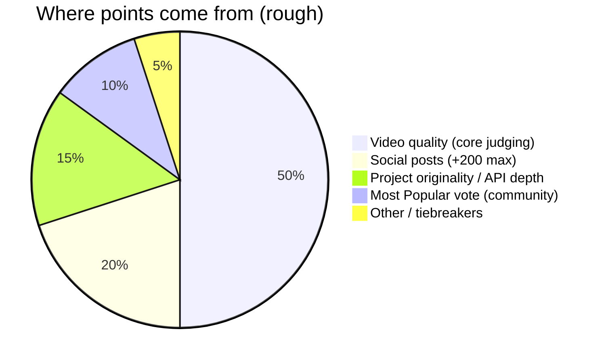
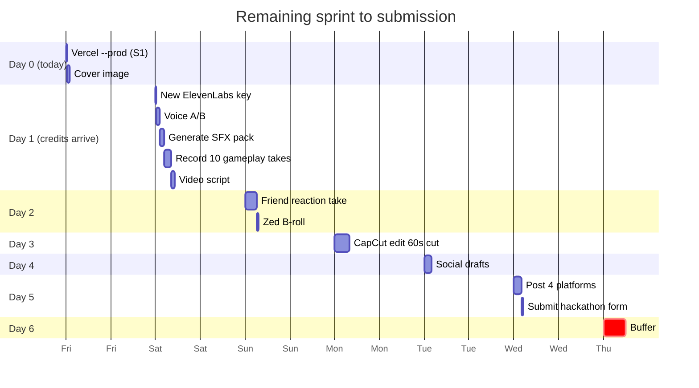
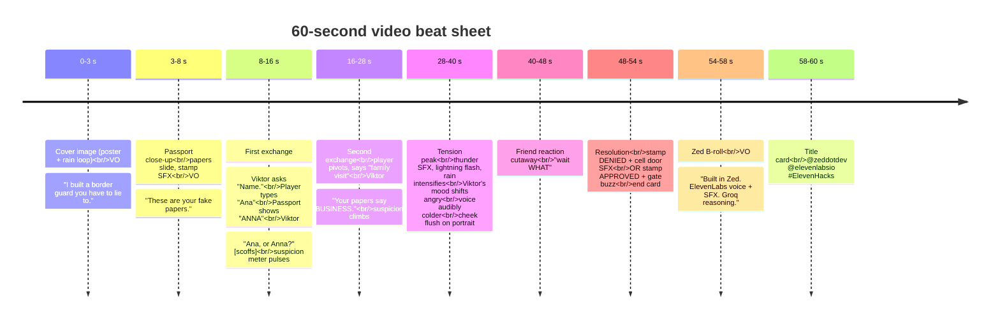

# Submission plan

> The week-sprint doc. Everything between here and the `hacks.elevenlabs.io/hackathons/5` submit button.

## Hard facts (from [hacks.elevenlabs.io/guide](https://hacks.elevenlabs.io/guide))

| Rule | Value |
|---|---|
| Deadline | **~6 days** from 2026-04-24 |
| Video length | **≤ 90 seconds** (ideal 60) |
| Video resolution | **1080p minimum** (9:16 vertical for social reach) |
| Captions | **Required** — most social video watched on mute |
| Cover image | **Required** — shown in Most Popular gallery vote |
| Required mentions | **ElevenLabs AND Zed** — verbally in video |
| Judge priority | Video first. "Plan to spend at least half your time on the submission video, if not more." |
| Social bonus | **+50 per platform × 4 = +200 max** (X, LinkedIn, Instagram, TikTok) |
| Placement prize | ≈ worth same as 200 social points |
| Required tags | `@elevenlabsio` · `@zeddotdev` · `#ElevenHacks` |

## Scoring math



Treat the video as **half the score**. Treat the 4-platform social post as the other **cheap** 20%. The passport + claim-memory mechanic is our originality play.

## What's already done (as of 2026-04-24)

Day 0 polish shipped — tests green, production build clean. Quick list:

- ✅ Passport + claim-memory mechanic (the headline differentiator)
- ✅ Per-secret opening lines
- ✅ Reactive rain + lightning (suspicion-driven)
- ✅ Viktor anatomy redesign (real face, life signs, mood-driven muscles)
- ✅ Background music (Kevin MacLeod, ducks under voice)
- ✅ Voice fallback (game plays without ElevenLabs credits)
- ✅ Scroll-jank fix + single-viewport layout (perfect for vertical capture)
- ✅ Input alignment + terminal prompt + keyboard hint
- ✅ Rust scaffold (deferred post-submission — judges don't care about backend language)

What's left is primarily capture + edit + post.

## The remaining timeline



## Day-by-day breakdown

### Day 0 — today (2026-04-24)

All Day 0 polish has already shipped (see Done list above). What's left for today:

| Task | Est. | Notes |
|---|---|---|
| **S1 `vercel --prod`** | 20 m | Link project, add `GROQ_API_KEY` + `ELEVENLABS_API_KEY` env vars, ship. Get a live URL for judges. |
| **W0f Cover image** | 30 m | Take a 1080×1920 screenshot of the game mid-turn (passport visible, meters mid-range, Viktor mid-reply) OR use a Claude Design poster. Save to `assets/cover.png`. |

### Day 1 — credits arrive (~2026-04-25)

**Prerequisite:** replace the current invalid `ELEVENLABS_API_KEY` in `.env.local` + Vercel env. The key logs 401 in the server console right now.

| Task | Est. | Notes |
|---|---|---|
| `/voice-ab` | 1 h | Generate 6-10 Viktor voice samples across candidate voice IDs × 4 moods × 3 canonical lines. Pick the strongest, update `ELEVENLABS_VOICE_ID`. |
| SFX pack generation | 1 h | Write `scripts/generate-sfx.ts`, hit `POST /v1/sound-generation` once for: `stamp-approved`, `stamp-denied`, `gate-buzz`, `radio-squelch`, `thunder-distant`, `door-slam`. Save to `public/sfx/`. Trigger at terminal states. |
| ElevenLabs Music track (optional replacement) | 30 m | Prompt: "slow, tense minimal synth, rain ambience, 70 bpm, cold, film noir, no drums, instrumental". Replace the Kevin MacLeod bed with custom-generated track if quality is better. Keep MacLeod as fallback. |
| 10 gameplay takes | 2 h | OBS, 1080p, system audio. Varied archetypes: sincere match-passport, bold lie, passport-contradiction catch, family plea, absurd, hostile, close-call at turn 6, fast win, spectacular arrest, clever misdirection. |
| Video script | 1 h | 3-5 bullets, not word-for-word. Opener + passport-catch moment + emotional/tension pivot + resolution. |

### Day 2 — the real-world take

Guide: *"Take it outside. Film yourself using it... with friends."* Most submissions won't do this. It's the differentiator.

| Task | Est. | Notes |
|---|---|---|
| Friend reaction take | 2-3 h | Phone or webcam on friend's face + screen recording in parallel. 2-3 rounds, don't coach them. The "wait WHAT" when Viktor catches a name mismatch IS the content. |
| Zed B-roll | 30 m | ~3 seconds of you editing the Viktor prompt (in `lib/llm.ts`) or a handler in Zed. Shows "built in Zed" credibly. |

### Day 3 — edit in CapCut

| Task | Est. | Notes |
|---|---|---|
| Import + rough cut | 1 h | Stitch beats per shot list below |
| Auto-captions + manual cleanup | 30 m | Bold centered, dark background. Most social video is watched on mute. |
| Music layer | 30 m | Either the Kevin MacLeod track we already use, or the ElevenLabs-generated track from Day 1, at 15-20 % under dialogue |
| Color / grade pass | 30 m | Match the noir tone of the cover |
| Export 1080p 9:16 | 15 m | MP4, H.264, 30 fps minimum. Save to `assets/submission.mp4` |

### Day 4 — social drafts

See [Social post templates](#social-post-templates) below. Platform-specific copy drafted, not yet posted.

### Day 5 — post everywhere + submit

- Post on X, LinkedIn, Instagram, TikTok (in that order, 30 min apart)
- Submit on `hacks.elevenlabs.io/hackathons/5` with: video, cover image, description, repo link, live URL

### Day 6 — buffer

Crisis day. Keep it empty on purpose.

## Video shot list (60 seconds) — passport-first

The passport + catch-the-lie moment in the first 8-16 seconds is the single most important part of the video. It's the "wait WHAT" that makes people share it.



### The first 5 seconds — pick ONE

Three contenders, pick whichever feels strongest before you record:

1. **Outcome-led:** *"I built a border guard you have to lie to — he reads your passport, remembers your answers, and catches you if you slip."*
2. **Bold claim:** *"This AI guard will decide if you live or go to prison. Watch what happens when I lie twice."*
3. **Wow-moment:** Jump straight into the passport-catch moment. Context comes at 0:08.

**Commit before recording.** Don't A/B in the edit.

## Cover image spec

- **Size:** 1080×1920 (9:16)
- **Source options:**
  1. Screenshot of the game mid-turn (passport visible, portrait speaking, meters mid-tension). Open game locally, take a screenshot, crop.
  2. Claude Design poster (if you've already made one). Open in Chrome DevTools, device mode 1080×1920.
- **Save as:** `assets/cover.png` in repo root (or use external host)
- **Why it matters:** gallery card thumbnail + Most Popular vote discoverability.

## Social post templates

### X / Twitter (native video upload)
```
I built a border-checkpoint game where every word you type is voiced back at you in real time — and the guard catches your lies.

You have fake papers. Try to stay consistent.

@zeddotdev @elevenlabsio #ElevenHacks
[live URL]
[native video]
```

### LinkedIn (story framing, ≤ 200 words, native video)
```
This week I built The Negotiator for #ElevenHacks — a narrative game where you type at a border guard and every word he says is streamed back as live AI voice. And he catches you lying.

You're handed a passport at game start — Name, Origin, Purpose. Viktor (the guard) can see it too. A second LLM extracts structured claims from what you say each turn, so when you contradict yourself — or your papers — he doesn't guess. He calls it out specifically: "You said Anna. Now you say Ana."

Trust ≥ 80 after 3 exchanges → cross. Suspicion ≥ 100 → arrested.

Built the whole thing in Zed with:
· Groq (Llama 3.3 70B) for Viktor's character + a concurrent claim extractor
· ElevenLabs Flash v2.5 for streaming TTS
· ElevenLabs Music / SFX for the atmosphere
· Next.js on Vercel

The audio isn't decoration — the guard's amplitude drives his mouth animation, and his mood (calm / angry / amused) shifts voice settings so he literally sounds different depending on how you're doing.

[live URL]

Try it. Tell me if Viktor catches you.

@zeddotdev @elevenlabsio
```

### Instagram Reels (vertical 9:16, captions on)
```
I made an AI border guard you have to lie to.

Every word he says is live AI voice.
He remembers what you said last turn.
Contradict yourself → he catches you.

@elevenlabsio @zeddotdev #ElevenHacks
link in bio
```

### TikTok (vertical 9:16, front-load the wow)
```
POV: you're at a checkpoint and the guard is AI.

Every word is voiced live. Every lie is tracked.
I built this in a week for @elevenlabsio × @zeddotdev.

Link in bio 🎧 #ElevenHacks #AI #hackathon
```

## Submission form checklist

When filling out the submission on `hacks.elevenlabs.io`:

- [ ] **Title:** The Negotiator
- [ ] **One-line pitch:** *"A border-checkpoint game where every word Viktor says is live AI voice — and he catches you when your lies don't match your papers."*
- [ ] Repo URL
- [ ] Live demo URL (from S1)
- [ ] Cover image (1080×1920)
- [ ] Video (uploaded or linked)
- [ ] Description (see below)
- [ ] Tech stack: Next.js, Groq, ElevenLabs Flash v2.5 TTS + Music + SFX, Rust (scaffold), Zed

### Description (for the form)
```
The Negotiator is a one-scene narrative game. You're a traveler at a rainy midnight border checkpoint. Viktor Marek, the guard, has nineteen years on this post and a daughter who hasn't called in two years.

You're given a passport — Name, Origin, Purpose. Viktor can see it too. You type; he responds. Every reply is streamed from ElevenLabs Flash v2.5, voice-tuned to his mood.

What makes it a game: a second Groq call runs in parallel each turn, extracting structured claims from what you said. Viktor's system prompt carries both the passport's ground truth AND the running list of your claims. When you contradict yourself — or your papers — he doesn't guess. He calls it out: "You said Anna. Now you say Ana. Which is it?" Trust climbs when you stay consistent. Suspicion climbs when you don't. Cross at trust ≥ 80 after 3 exchanges. Fail to convince him and suspicion hits 100 — you're arrested.

Built in Zed. Groq (Llama 3.3 70B) drives Viktor's character AND the claim extractor via forced-schema tool calls. ElevenLabs Flash v2.5 streams the voice; amplitude drives mouth animation in real time. Mood changes voice settings (stability, style) so he literally sounds different depending on how you're doing. Rain intensifies and lightning flashes as suspicion climbs. Background music ducks under his voice.

56 tests across TypeScript reducer + gate + claim-merge logic + Rust type contracts. Zero-cost stack on Vercel + Cloudflare Workers.
```

## The submission checklist from the guide

- [ ] Spent at least half of total time on the video, not just the code
- [ ] One-sentence value prop in the first 5 seconds
- [ ] Demo under 90 seconds
- [ ] Captions added for muted viewing
- [ ] Background music (preferably ElevenLabs Music — swap from Kevin MacLeod if generated track is strong)
- [ ] ElevenLabs SFX pack triggered at key moments (stamp / buzz / thunder / door slam)
- [ ] Posted on 4 platforms (+50 each = +200)
- [ ] Clear description in the submission form
- [ ] Repo link AND live demo URL included
- [ ] Tagged `@elevenlabsio` and `@zeddotdev`
- [ ] Cover image uploaded for Most Popular vote

## What we are NOT doing for this submission

| Cut | Reason |
|---|---|
| Rust port (R2-R7) | Judges don't evaluate backend language. Every hour on Rust is an hour not on the video. Deferred to post-submission. |
| Second scenario / second guard | Scope creep. `.claude/skills/new-scenario/` gate refuses to scaffold. |
| Mobile native app | Web submission is sufficient. Vertical 9:16 video is where mobile viewership happens. |
| DashMap sessions / WebSockets | Never needed. Stateless backend. |
| AWS / GCP / Docker | Vercel + Cloudflare + $0. |
| Custom domain | `*.vercel.app` is fine. |

## See also

- [STATUS.md](STATUS.md) — live progress against this plan
- [ARCHITECTURE.md](ARCHITECTURE.md) — system design
- [../CLAUDE.md](../CLAUDE.md) — agent conventions
- [../session.md](../session.md) — live handoff doc
