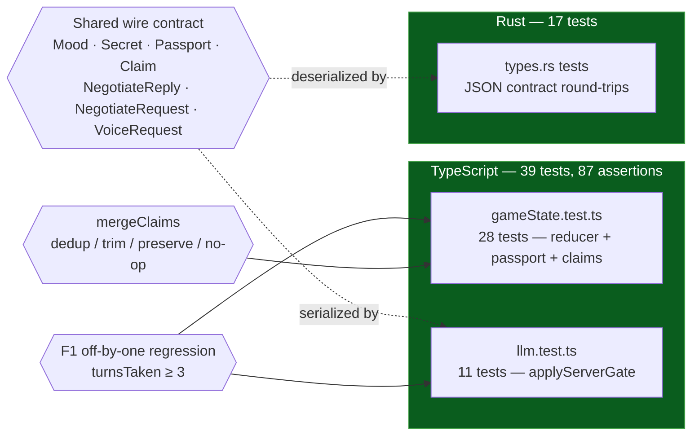
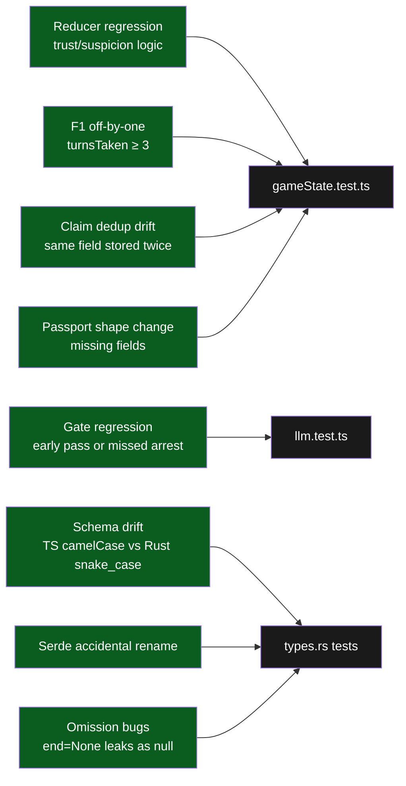

# Testing

> 56 tests across two languages. Everything we care about is covered; everything we deliberately don't test is listed at the bottom with a reason.

## At a glance



## Commands

```bash
bun run test           # 39 TS tests via bun test          ~180 ms
bun run test:rust      # 17 Rust tests via cargo test       ~0 ms runtime (compile ~23s cold)
bun run test:all       # both, sequentially                 ~24 s cold / ~1 s warm
bun run typecheck      # tsc --noEmit
bun run lint           # eslint
cd backend && cargo clippy -- -D warnings    # only dead-code warnings on deferred types
```

Run `bun run test:all` before committing. It's the one command that catches both reducer regressions and cross-language contract drift.

## Philosophy

What belongs in a unit test:

- **Pure functions** with clear inputs and outputs (`reducer`, `applyServerGate`, `mergeClaims`)
- **State machines** and their transitions
- **Data contracts** — the JSON shape the TS client sends and the Rust server accepts, and vice versa
- **Regressions** — every bug we've fixed gets a test that would have caught it

What does NOT belong in a unit test for this codebase:

- React components — visual review is faster and catches more
- Framer Motion animations — no meaningful invariant to assert
- Calls to Groq / ElevenLabs — mocking the external API makes the test tautological; real integration happens via `scripts/playtest.ts`
- The `useGuardVoice` hook or `useBackgroundMusic` hook — requires `AudioContext` + `HTMLAudioElement`; belongs in E2E territory
- CSS keyframes — rendered output is the test
- Portrait SVG — visual diff tools are overkill here

## TS suite — `bun test`

### `lib/gameState.test.ts` (26 tests)

| Group | Cases |
|---|---|
| `createInitialState` | starts balanced (35/35, empty history, speaking); secret is valid; **passport populated with name/origin/purpose**; **claims start empty** |
| `mergeClaims` | empty→add; dedup by field (latest wins); preserve other fields when restating one; trim whitespace + drop empty; return same reference when incoming is empty |
| `PLAYER_SUBMIT` | appends player turn, flips to thinking, leaves meters alone |
| `GUARD_REPLY` deltas | applies positive/negative deltas, clamps at 0/100 |
| `GUARD_REPLY` history | appends guard turn with mood |
| `GUARD_REPLY` terminals | `end=pass` → won; `end=arrest` → lost; suspicion≥100 → lost |
| `GUARD_REPLY` gate | **trust≥80 with 3 player turns → won** (F1 fix); **trust≥80 with 2 turns → still speaking** (regression) |
| `GUARD_REPLY` turnCap | at turn 6: trust>suspicion → won; else → lost |
| `GUARD_REPLY` claims | **`updatedClaims` merges into `state.claims`**; **missing `updatedClaims` preserves reference** |
| `SPEAKING_END` | speaking → idle; preserves terminal won/lost (reference equality); no-op on idle/thinking |
| `RESET` | returns a fresh initial state with history + claims cleared |

### `lib/llm.test.ts` (13 tests)

| Group | Cases |
|---|---|
| `"none"` sentinel | always stripped (schema workaround, never a real value) |
| `end=pass` gate | stripped when exchange<3 OR trust+Δ<80; kept when both satisfied; works at later exchanges |
| `end=arrest` gate | stripped when suspicion+Δ<100; kept when ≥100; exchange count irrelevant |
| purity | input reply object not mutated; other fields untouched |
| edge cases | clamped-up trust still passes; negative delta disqualifying pass; no-op when end already undefined |

## Rust suite — `cargo test`

### `backend/src/types.rs::tests` (17 tests)

All tests are pure serde round-trips — they run on the **host (macOS) target**, not wasm, so `cargo test` in `backend/` just works.

| Group | Cases |
|---|---|
| `Mood` | serializes "calm"/"suspicious"/"angry"/"amused"; deserializes same |
| `Secret` | serializes "contraband"/"fake_passport"/"fugitive" (snake_case matching TS); round-trips |
| `Role` | "guard"/"player" lowercase |
| `EndKind` | "pass"/"arrest" lowercase |
| `NegotiateReply` JSON | emits camelCase `trustDelta`/`suspicionDelta`/`voiceStyle`; **does not** emit snake_case |
| `NegotiateReply` end | omits `end` when `None`; emits `"pass"` when `Some(EndKind::Pass)` |
| `NegotiateReply` fallback | omits `fallback` when `false`; emits `true` when set |
| `NegotiateRequest` parsing | parses `"playerInput"` into `player_input`; full history with mixed turns |
| `NegotiateRequest` strictness | **rejects snake_case `"player_input"`** — catches accidental rename |
| `Turn` | omits `mood` when `None`; includes when `Some` |
| `VoiceRequest` | parses `{text, mood}` from TS client shape |

**Note for R2:** when the Rust backend implements real logic, the `Passport` and `Claim` types will need matching Rust structs and their own round-trip tests — follow the existing pattern.

## What each test catches



## Adding a test

### For TS (reducer / pure logic)

1. Is the function pure? If not, refactor it to be (see how `applyServerGate` moved from `lib/llm.ts` → `lib/gate.ts` to avoid `server-only`).
2. Import from `bun:test`: `import { describe, expect, it } from "bun:test"`.
3. Put the file next to the module: `lib/foo.ts` → `lib/foo.test.ts`.
4. `bun run test` to run the whole suite.

### For Rust (types / pure Rust logic)

1. Add an inline `#[cfg(test)] mod tests { ... }` at the bottom of the module.
2. Use `use super::*;` to pull parent items into scope.
3. `cd backend && cargo test`.

Avoid adding dependencies for testing. `serde_json::{json, to_value, to_string, from_value, from_str}` covers every contract test we need.

## What we deliberately don't test

| Area | Why not |
|---|---|
| React component rendering | Visual review is faster; animation assertions are brittle |
| Framer Motion animations | No meaningful invariant; maintenance cost >> value |
| `useGuardVoice` amplitude | Requires AudioContext; belongs in E2E (Playwright) if we ever want it |
| `useBackgroundMusic` volume fades | Requires HTMLAudioElement + RAF in browser; same story |
| Groq calls | Mocking returns our own prompt back; tautological |
| `extractClaims` output quality | It's a live LLM call; we cover the **wire shape** in `/api/negotiate` (returns `Claim[]`), not the LLM's semantic judgment. Use `scripts/playtest.ts` for live validation. |
| ElevenLabs calls | Same reason; live testing via `scripts/playtest.ts` or `/voice-ab` skill |
| `app/page.tsx` orchestration | End-to-end territory; covered by manual playtest |
| Portrait SVG correctness | Visual review; no logic under test |
| CSS / Tailwind | No logic; visual diff tools are overkill here |
| Wrangler / Vercel deploy | Integration tested by actually running them |

## When to add a test

- You just fixed a bug → write a test that would have caught it (examples: F1 off-by-one regression; claim dedup).
- You're refactoring pure logic → tests first, then change code.
- You're adding a new field to `NegotiateReply`, `Passport`, or `Claim` → update both TS and Rust, add a types test asserting the contract.
- A reviewer asks "how do you know this still works?" → the test IS the answer.

## When *not* to add a test

- The function has no branching (trivial getters, passthroughs).
- The test would mock the thing under test.
- Coverage for its own sake.

## CI integration (future)

Not yet wired — planned as one GitHub Action:

```yaml
# .github/workflows/test.yml (future)
- run: bun install
- run: bun run test
- run: cd backend && cargo test
- run: bunx tsc --noEmit
- run: bunx eslint .
- run: cd backend && cargo clippy -- -D warnings
- run: bun run build
```

Until then: run `bun run test:all` before committing.
